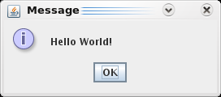

---
aliases:
- /coolnamehere/2007/10/29_jruby.html
- /post/2007/jruby/
- /2007/10/29/jruby/
category: post
created: 2024-01-15 15:26:18-08:00
date: 2007-10-29 00:00:00-07:00
slug: jruby
tags:
- ruby
- java
- coolnamehere
title: JRuby
updated: 2024-02-01 20:21:38-08:00
---

There is more than one way to experiment with [Ruby](../../../card/Ruby.md). [JRuby](http://jruby.org/) is a mature version of Ruby written for the Java Virtual Machine. This gives you a great deal of platform independence, since JRuby will comfortably run anywhere that [Java](../../../card/Java.md) runs. It also provides you with access to Java’s *huge* [standard library](http://www.java.com/en/download/index.jsp). I thought I would take a little time to examine the JRuby implementation, which is nearing a 1.0 release.

We need Java before we can do anything with JRuby, though. I already have 1.6.0 installed on my machine. If you don’t have Java, now is the time to [get it](http://www.java.com/en/download/index.jsp).

With Java safely installed on our machine, it is time to download and install JRuby. The [download](http://jruby.org/download) is a simple archive file — most Windows users will want to go for the zipped version, since that is best understood by their system. I grabbed the tarred and gzipped archive of the binaries for myself. An automatic installer would be nice, but it isn’t the sort of thing that’s going to stop me.

The archive contains a `bin` folder containing several interesting files. The ones which interest me most are `jruby`, `jirb`, and `gem`. Supporting [Ruby Gems](http://rubygems.org) means that we can install from the standard Ruby repositories. I need to put this folder at a sensible location on my system, and then put that location on my path.

````
$ sudo mv jruby-1.2.0RC1/ /opt/jruby
$ export PATH=/opt/jruby/bin:$PATH
$ which jirb
/opt/jruby/bin/jirb
````

I got that right, so I can safely add the `export PATH` line to my `$HOME/.bash_profile` when I feel like it.

There’s probably a quick way to do it in Windows as well, but here’s what I know how to do.

1. Open the Control Panel
1. Select "System"
1. Select "Advanced system settings"
1. Select "Environment Variables" button.
1. Select "Path" from System Variables if you have admin privileges,
   otherwise from User variables.
1. Click "Edit".
1. At the beginning of the "Variable value" field, put the location of
   your `jruby\bin` folder: `C:\jruby\bin;C:\Ruby\bin;%PATH%`
1. Click "Ok" until all those lovely dialog boxes go away.

Now you should be able to access the JRuby commands from any console. The Windows command prompt is accessible via the Start Menu, under Accessories.

I want to make sure the Java interface works, so I’ll fire up the `jirb` shell —

````
$ jirb
````

— and test with a quick Swing "Hello World" dialog borrowing from the
[Hello World Repository](http://www.roesler-ac.de/wolfram/hello.htm#Java-Swing).

````
irb(main):001:0> include_class('javax.swing.JOptionPane')
=> ["javax.swing.JOptionPane"]
irb(main):002:0> JOptionPane.showMessageDialog(nil, "Hello World!")
=> nil
````


JRuby "Hello World"

That popped up a simple "Ok" style dialog box with the message "Hello World!".