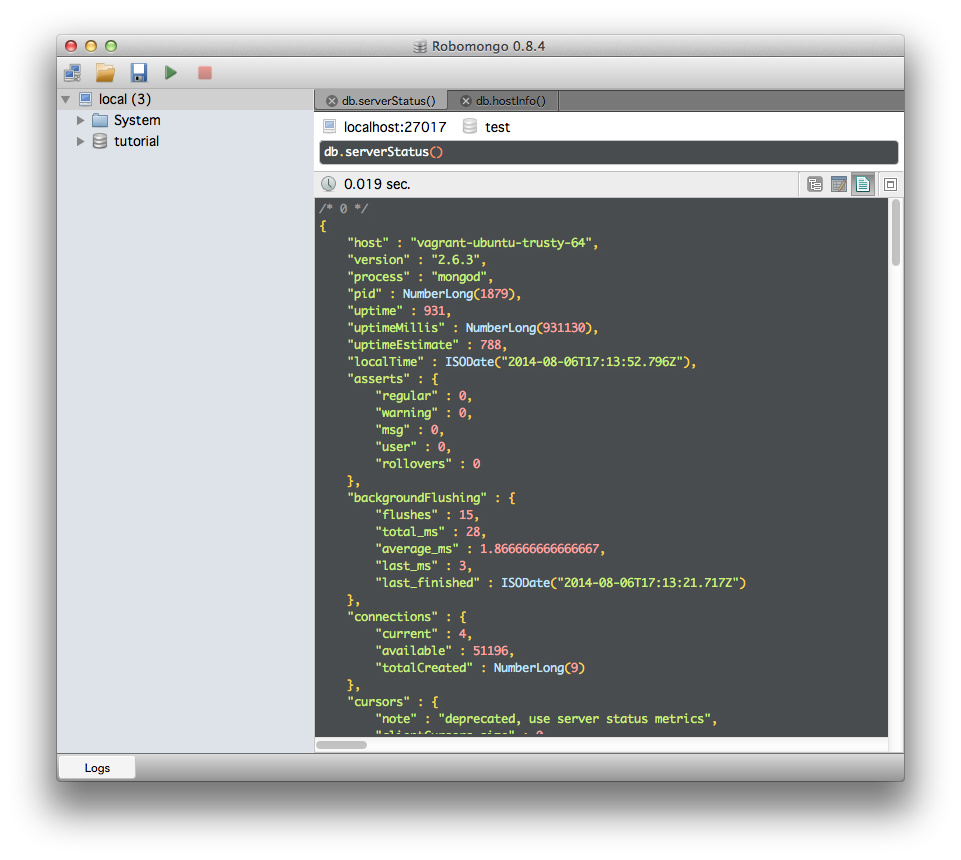

---
aliases:
- /tools/2014/08/06_mongo-vagrant-connect.html
- /post/2014/mongo-vagrant-connect/
- /2014/08/06/connect-to-mongodb-on-a-vagrant-box-from-the-host/
category: post
date: 2014-08-06 00:00:00-07:00
slug: connect-to-mongodb-on-a-vagrant-box-from-the-host
tags:
- vagrant
- mongodb
- tools
title: Connect To MongoDB on a Vagrant box from the host
---


[Yesterday](trusty-mongo-mojo-box.md) I finished a little project to set up a reusable Vagrant box for MongoDB and [card/Perl](../../../card/Perl.md) Mojolicious experiments. That project is okay as it is right now, but I would like to get at MongoDB from the host system.

<!--more-->

It is not painfully difficult, but it would be easy for me to forget. That is why I made a post out of it.

Adjust the Vagrantfile so that the MongoDB guest port is forwarded to a host port.

````ruby
VAGRANTFILE_API_VERSION = "2"

Vagrant.configure(VAGRANTFILE_API_VERSION) do |config|

  # Use Ubuntu 14.04 64 bit
  config.vm.box = "ubuntu/trusty64"

  # Install system requirements
  config.vm.provision "shell", path: "bootstrap/system.sh"
  
  # Configure guest services to be accessible on host
  config.vm.network "forwarded_port", guest: 3000, host: 3000
  config.vm.network "forwarded_port", guest: 27017, host: 27017
end
````

Inside the box, comment out the `bind_ip` line from `/etc/mongod.conf`.

````bash
# Listen to local interface only. Comment out to listen on all interfaces.
# bind_ip = 127.0.0.1
````

Restart the `mongod` service.

````
$ sudo service mongod restart
````

Connect to Mongo from the host using whatever interface you prefer. I have been enjoying [Robomongo](http://robomongo.org/).
