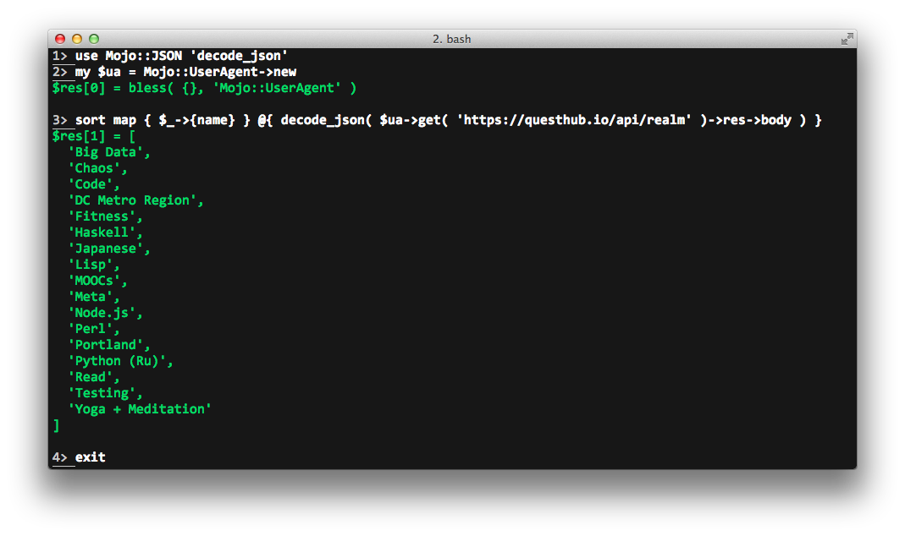

---
aliases:
- /tools/2014/08/14_perl-reply-repl.html
- /post/2014/perl-reply-repl/
- /2014/08/14/repl-in-perl-with-reply/
category: post
created: 2024-01-15 15:25:51-08:00
date: 2014-08-14 00:00:00-07:00
series:
- The Reply Perl REPL
slug: repl-in-perl-with-reply
syndication:
  twitter: https://twitter.com/brianwisti/status/500033601124052992
tags:
- perl
- reply
- mojolicious
- tools
title: REPL In Perl With Reply
updated: 2024-02-01 20:46:40-08:00
---



Time for a quick post about [Reply](https://metacpan.org/release/Reply), a new [Perl](../../../card/Perl.md) toy from [Jesse Luers](http://tozt.net/). There will not be much for me to say, because I have only been playing with it for about twenty minutes.

 > 
 > **NOTE**
>
 > This post used Questhub.io for a subject. Unfortunately, that site is no longer with us.

Reply is a [REPL](http://en.wikipedia.org/wiki/Read%E2%80%93eval%E2%80%93print_loop) for Perl. It is an interactive shell that simplifies quick experimentation with language features. It is extensible via a [plugin](https://metacpan.org/source/DOY/Reply-0.35/lib/Reply/Plugin.pm) system that I may look at later if I have more time.

## Installation

I use [perlbrew](http://perlbrew.pl) and [cpanm](https://github.com/miyagawa/cpanminus), so installation was easy.

````
$ cpanm Reply
````

Oh. It is worth pointing out that if you do not have [GNU Readline](http://cnswww.cns.cwru.edu/php/chet/readline/rltop.html) or a similar library installed, you will not get command-line editing or history in Reply.

## Hello Reply

The `reply` command starts a new session. Once the session is going, it’s pretty much just Perl.

````
$ reply
0> "Hello World"
$res[0] = 'Hello World'

1> my $name = "Brian"
$res[1] = 'Brian'

2> "Hello $name"
$res[2] = 'Hello Brian'
````

Getting user input via `STDIN` works pretty much how you would expect.

````
3> chomp( $name = <STDIN> )
Brian
$res[3] = 1

4> $name
$res[4] = 'Brian'
````

Defining subroutines is no big deal.

````
5> sub greeting { "Hello $_[0]" }
6> greeting $name
$res[5] = 'Hello Brian'
````

And `exit` will quit Reply. It all seems straightforward.

````
7> exit
````

## A Marginally More Complex Example

I have been working on a little experiment: fetching Questhub.io JSON with [Mojo::UserAgent](http://mojolicio.us/perldoc/Mojo/UserAgent) and [Mojo::JSON](http://mojolicio.us/perldoc/Mojo/JSON). I decided to see if I could try some of that experiment in Reply.

````
0> use Mojo::UserAgent
1> use Mojo::JSON 'decode_json'
2> my $ua = Mojo::UserAgent->new
$res[0] = bless( {}, 'Mojo::UserAgent' )

3> sort map { $_->{name} } @{ decode_json( $ua->get( 'https://questhub.io/api/realm' )->res->body ) }
$res[1] = [
  'Big Data',
  'Chaos',
  'Code',
  'DC Metro Region',
  'Fitness',
  'Haskell',
  'Japanese',
  'Lisp',
  'MOOCs',
  'Meta',
  'Node.js',
  'Perl',
  'Portland',
  'Python (Ru)',
  'Read',
  'Testing',
  'Yoga + Meditation'
]
````

Yes, I can.

## What Do I Think?

I like Reply overall. I am not used to thinking in REPL terms when it comes to Perl, and need to spend more than twenty minutes with it. I like Reply enough that I do expect to spend more time with it.

I noticed that my coding style was more terse within the confines of Reply. Maybe I should install GNU Readline support on my machine or enable the [Editor plugin](https://metacpan.org/pod/Reply::Plugin::Editor).