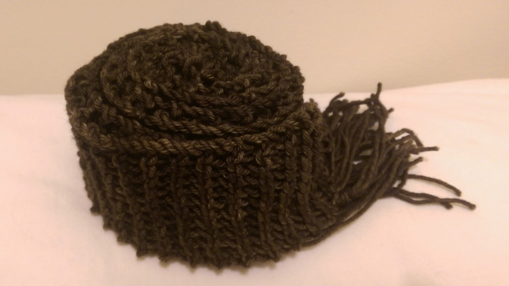

---
aliases:
- /craft/2015/quick-garter-scarf/
- /2015/04/04/quick-garter-stitch-scarf/
category: post
date: 2015-04-04 00:00:00-07:00
slug: quick-garter-stitch-scarf
tags:
- knitting
- scarf
- craft
title: Quick Garter Stitch Scarf
created: 2024-01-15T15:25:52-08:00
updated: 2024-01-26T10:12:55-08:00
---

I made a scarf for a friend. Nothing fancy, though the choice of soft, cozy [Tosh Merino](http://madelinetosh.com/store/index.php/yarns/tosh-merino.html) convinced her otherwise. She requested a long and skinny scarf. The finished product measures just over six feet long and four - wait, let me measure: *three* -  inches wide. I had enough yarn to go longer, but if she's happy I'm happy.

<!--more-->

I followed the "Loopy Garter Stitch Skinny Scarf" instructions from this [blue blog](http://alison.knitsmiths.us/pattern_beginners_scarves.html) patterns page, using size 13 needles. I never made fringe before, and found the [wikiHow](http://www.wikihow.com/Add-Fringe-to-a-Crochet-or-Knit-Project) instructions helpful.

There. Now I have a reference if somebody asks how I made that scarf, or I want to make another one like it. The blue blog patterns are handy for getting started. They were also handy for getting me back into practice. Sometimes you need to step back and do something simple when your yarn basket is full of ambitious works in progress. Gets the morale back up.
