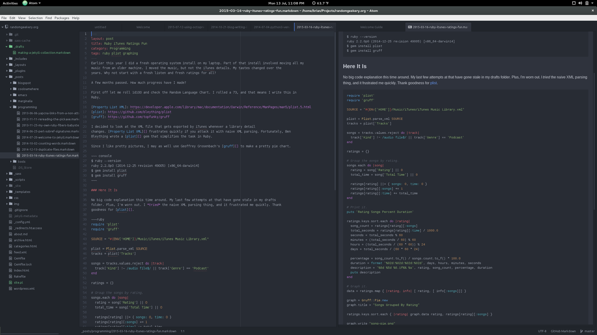

---
aliases:
- /tools/2015/07/13_atom-works-on-opensuse.html
- /post/2015/atom-works-on-opensuse/
- /2015/07/13/atom-works-on-opensuse/
category: post
date: 2015-07-13 00:00:00-07:00
slug: atom-works-on-opensuse
tags:
- suse
- atom-editor
- tools
title: Atom Works on openSUSE
created: 2024-01-15T15:25:52-08:00
updated: 2024-02-01T22:06:48-08:00
---

Thought I'd try the [Atom Editor](https://atom.io) on my [openSUSE](http://opensuse.org) Tumbleweed install. 

<!--more-->

RPMs and DEB files are available from the Atom site, and the RPM works just fine for me. There's the Markdown for [ruby-itunes-ratings-fun](../03/ruby-itunes-ratings-fun.md), a live preview, and some sort of Git integration showing up in the sidebar.

Since I'm more of a [Vim](../../../card/Vim.md) person, I don't really know what to do with Atom just yet. I may end up not doing much of anything with it. But at least I  now it works. Go ahead and try it out if you're curious.
