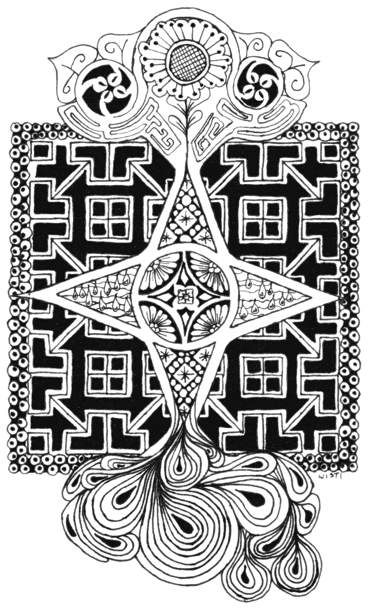

---
aliases:
- /marginalia/2015/08/01_celtic-tangle.html
- /craft/2015/celtic-tangle/
- /2015/08/01/celtic-tangle/
category: post
date: 2015-08-01 00:00:00-07:00
slug: celtic-tangle
tags:
- drawing
- zentangle
- celtic
- craft
title: Celtic Tangle
created: 2024-01-15T15:25:52-08:00
updated: 2024-01-26T10:13:10-08:00
---

Another [Zentangle](../../../card/Zentangle.md) practice. This time I mixed in a couple of minor Celtic design elements.

<!--more-->

I tried cleaning it up with [GIMP](http://www.gimp.org/). The end result displeased me so much that I switched to a grayscale of the original scan.
