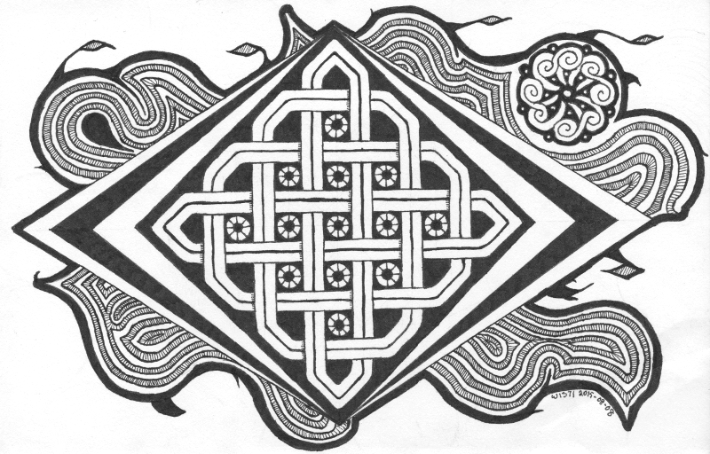

---
aliases:
- /marginalia/2015/08/08_wrapped-panel.html
- /craft/2015/wrapped-panel/
category: post
date: 2015-08-08 00:00:00-07:00
description: |
  I like this one. Stretching myself with each picture is starting to look interesting.
slug: wrapped-panel
tags:
- drawing
- celtic
- craft
title: Wrapped Panel
created: 2024-01-15T15:25:52-08:00
updated: 2024-01-26T10:13:12-08:00
---

I like this one. Stretching myself with each picture is starting to look interesting.

<!--more-->

Started as basic Celtic knotwork practice the other day. Put aside because I thought it needed more, but had no idea. Picked it up this morning and apparently had ideas.

That little circle in the corner is me getting a sudden urge to try some [George Bain](https://en.wikipedia.org/wiki/George_Bain_(artist)) style construction. It - well - it's not exactly what I saw in my head, but it looks cool.
