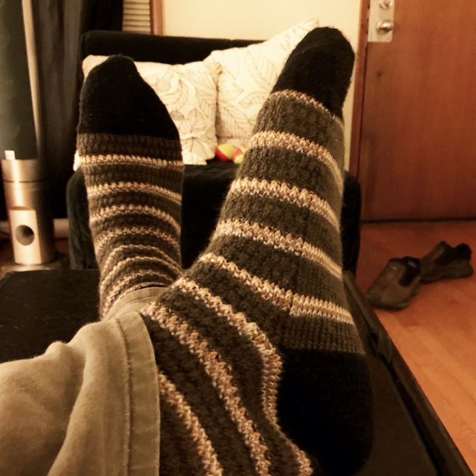

---
aliases:
- /craft/2015/my-first-socks/
- /2015/11/25/my-first-socks/
category: post
date: 2015-11-25 00:00:00-08:00
slug: my-first-socks
tags:
- knitting
- socks
- craft
title: My First Socks
created: 2024-01-15T15:25:52-08:00
updated: 2024-01-26T10:13:21-08:00
---

Not my first socks ever, of course. But there are many firsts in these socks.

<!--more-->

* They're mine! The rest have been for other people.
* toe-up
* [Judy's Magic cast-on](http://www.doctorwhoscarf.com/s12.html)
* short-row heels
* two different yarns (a black yarn and a self-striping brown, both 4-ply wool/poly by Regia)

Mistakes were made. I'm not sure whether it was due to gauge issues or bad math, but toe and heel ended up pointy. So these socks feel a little long when I wear them. Still nice if I don't wear them jogging. Lessons learned.

These semed to go faster than top-down socks with heel flaps.

I think my second pair will be simpler. Maybe just one type of yarn.
