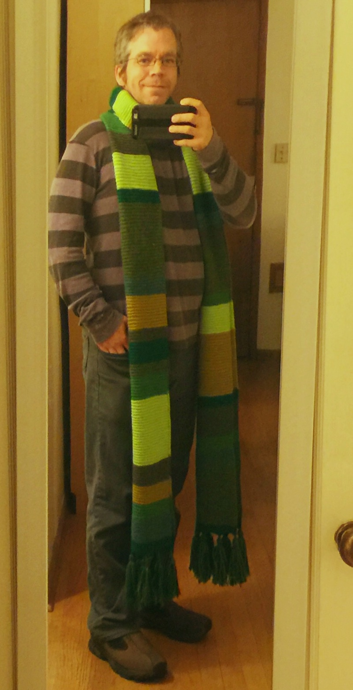

---
aliases:
- /craft/2015/professor-whom-scarf/
- /2015/11/02/professor-whom-scarf/
category: post
date: 2015-11-02 00:00:00-08:00
slug: professor-whom-scarf
tags:
- knitting
- scarf
- craft
title: Professor Whom Scarf
created: 2024-01-15T15:25:52-08:00
updated: 2024-01-26T10:13:22-08:00
---

I know it's a silly name. See, I found a [pattern site](http://doctorwhoscarf.com) for scarves from the [Doctor Who](https://en.wikipedia.org/wiki/Doctor_Who) TV show. http://doctorwhoscarf.com contains great patterns and solid advice throughout. This scarf uses the pattern for the [original scarf](http://www.doctorwhoscarf.com/s12.html), with some differences.

<!--more-->

* I replaced the original scarf colors with an assortment of greens.
* It's only about 75% of the knitted rows from the pattern.

With those differences, it hardly seemed fair calling it a "Doctor Who" scarf.
