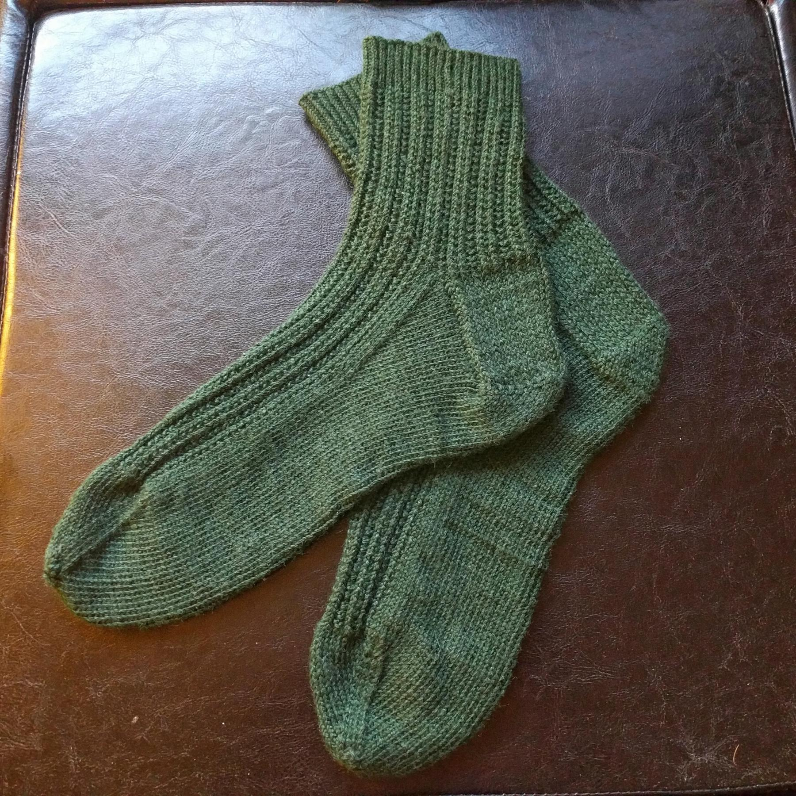

---
aliases:
- /craft/2016/my-twin-rib-socks/
- /2016/01/30/my-twin-rib-socks/
category: post
created: 2024-01-15 15:26:51-08:00
date: 2016-01-30 00:00:00-08:00
description: 'Took me a couple months because I started a pair for my mom in the middle
  of making this pair.

  '
slug: my-twin-rib-socks
tags:
- knitting
- socks
- craft
title: My Twin Rib Socks
updated: 2024-01-26 10:16:59-08:00
---

This is from Charlene Schurch’s book *Sensational Knitted Socks*. Nearly every sock I make is, to be honest. Great book. The yarn is [Cascade Yarns Heritage Silk](http://www.cascadeyarns.com/cascade-HeritageSilk.htm) 5608 "Pine". A single 100 gram hank served almost perfectly for my US size 10.5 feet. The amount of yarn left over (5 grams) is so small that it’s nearly a choking hazard.

I blocked these on sock hangers, but that made them look *more* lumpy. The socks are a little larger than the hangers. You can see where the corner of the hanger deformed them a bit at the top of the heel. I assume that will bounce back after wearing and washing. Still - future pairs will likely get blocked flat.

They look and feel great on my feet. For the first time I understand why my ex was always requesting more socks.