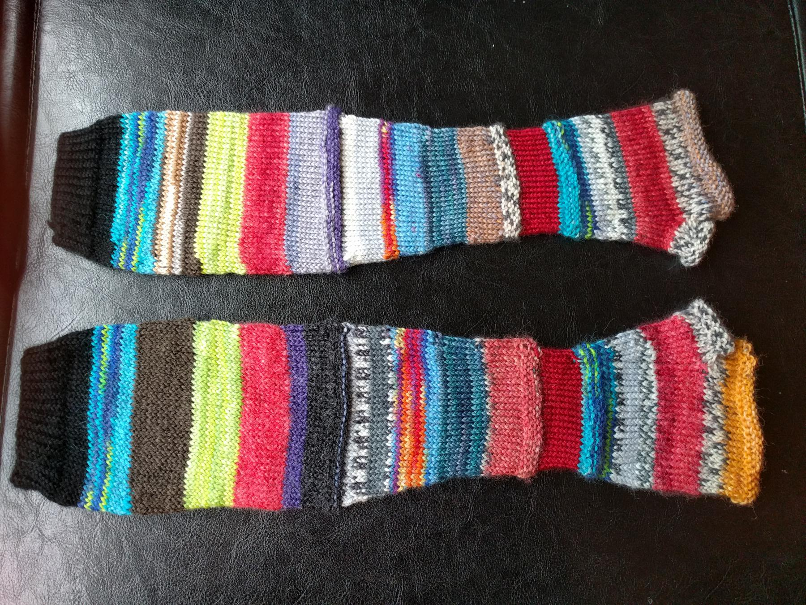

---
aliases:
- /craft/2016/rainys-mishmash-gloves/
- /2016/03/20/rainys-mish-mash-gloves/
category: post
created: 2024-01-15 15:26:51-08:00
date: 2016-03-20 00:00:00-07:00
slug: rainys-mish-mash-gloves
tags:
- knitting
- gloves
- craft
title: Rainy's Mish-Mash Gloves
updated: 2024-01-26 10:17:03-08:00
---

By special request, some fingerless gloves using a bit of every sock yarn I own.

<!--more-->

When I offered to make a pair, my friend pointed out a pair she had seen on Etsy. I started from a straightforward pattern in Sally Melville's [The Knitting Experience Book 2: The Purl Stitch](https://www.goodreads.com/book/show/24691.The_Knitting_Experience).

Yes I'll try to find that pair on Etsy again at some point, because it's a great design and people should buy that designer's stuff.