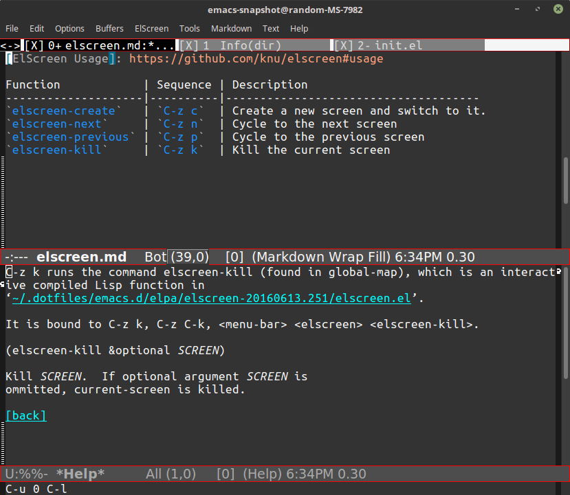

---
aliases:
- /post/2017/elscreen/
- /2017/01/11/elscreen/
category: post
date: 2017-01-11 00:00:00-08:00
slug: elscreen
tags:
- emacs
- elscreen
- tools
title: elscreen
created: 2024-01-15T15:26:50-08:00
updated: 2024-02-01T20:11:23-08:00
---

I use [ElScreen](https://github.com/knu/elscreen/) every time I open [Emacs](../../../card/Emacs.md). May as well make a quick note about it.

<!--more-->



I admit it. I’m still more of a [Vim](../../../card/Vim.md) user. The workflow I’m used to is Vim with some tabs, usually sitting in a [tmux](https://tmux.github.io/) session. When in Emacs I use ElScreen, which basically gives me tmux inside Emacs.

If you know what that means, great. If not, then pretend ElScreen is a weird way to make emacs a tabbed editor.

## Install It

[ErgoEmacs](http://ergoemacs.org/) has a nice [guide](http://ergoemacs.org/emacs/emacs_package_system.html) to using the Emacs package manager. With that as your guide, find and install the [elscreen package](https://melpa.org/#/elscreen) from [MELPA](https://melpa.org/).

Start ElScreen in your init file.

````elisp
(elscreen-start)
````

Now the elscreen commands are available throughout your Emacs session.

## Use It

[ElScreen Usage](https://github.com/knu/elscreen#usage) shows *many* commands for ElScreen. I manage with just a few.

|Function|Keys|Description|
|--------|----|-----------|
|`elscreen-create`|`Ctrl+z c`|Create a new screen and switch to it.|
|`elscreen-next`|`Ctrl+z n`|Cycle to the next screen|
|`elscreen-previous`|`Ctrl+z p`|Cycle to the previous screen|
|`elscreen-kill`|`Ctrl+z k`|Kill the current screen|
|`elscreen-help`|`Ctrl+z ?`|Show ElScreen key bindings|

I know. A tutorial or something would be nice. But every time I start to write a tutorial for something, I think of one more detail that hasn't been covered and the cycle starts all over again on the new detail. Just needed *something* here so I could shut my brain up about "why don't you mention ElScreen?"
