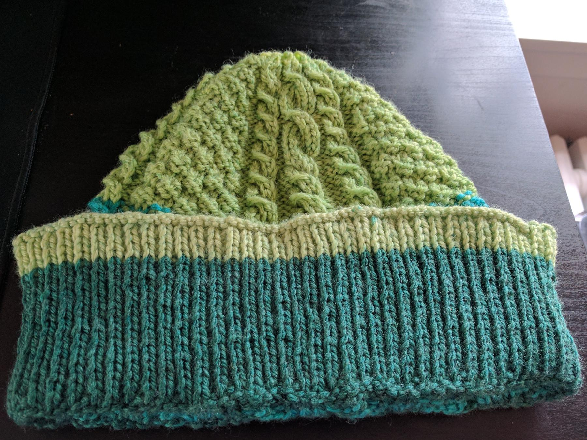

---
aliases:
- /craft/2017/my-weston-hat/
- /2017/06/28/my-weston-hat/
- /post/2017/06/my-weston-hat/
category: post
date: 2017-06-28 00:00:00-07:00
slug: my-weston-hat
tags:
- knitting
- hat
- craft
title: My Weston Hat
created: 2024-01-15T15:26:48-08:00
updated: 2024-02-01T21:57:23-08:00
---

Ended up *Knitting* this one twice. Tried the large size first, and it ended up way too large for my taste. Frogged and restarted the smaller size, making a new set of mistakes. But the hat fits now and I’m not starting again!

I went with the free [Weston pattern](https://www.garnstudio.com/pattern.php?id=7779&cid=17) by DROPS Design, using [Caron Cakes Lemon Lime](http://www.michaels.com/caron-cakes-yarn/M10481921.html) yarn. Mine doesn’t look much like theirs. Different yarn causes some of that. Mistakes in my cabling caused a little of it. Not sure about that ribbing, though. Mine measures correctly for the pattern, but looks *huge* compared to the sample image.

## Extra Notes

* I had to do some math for placing decreases from brim to body, as the pattern   didn’t specify placement.
* Switched from circular to DPNs for the decrease at the top. The pattern has three repeats, so you either need to be smart about placing your dpns —   which I did with the first version — or you need to use 3 dpns and be careful about ladders — which I did with the second version.
* You will probably want a shorter ribbed section than the pattern describes if you want to knit their hat and show off the cabling.
