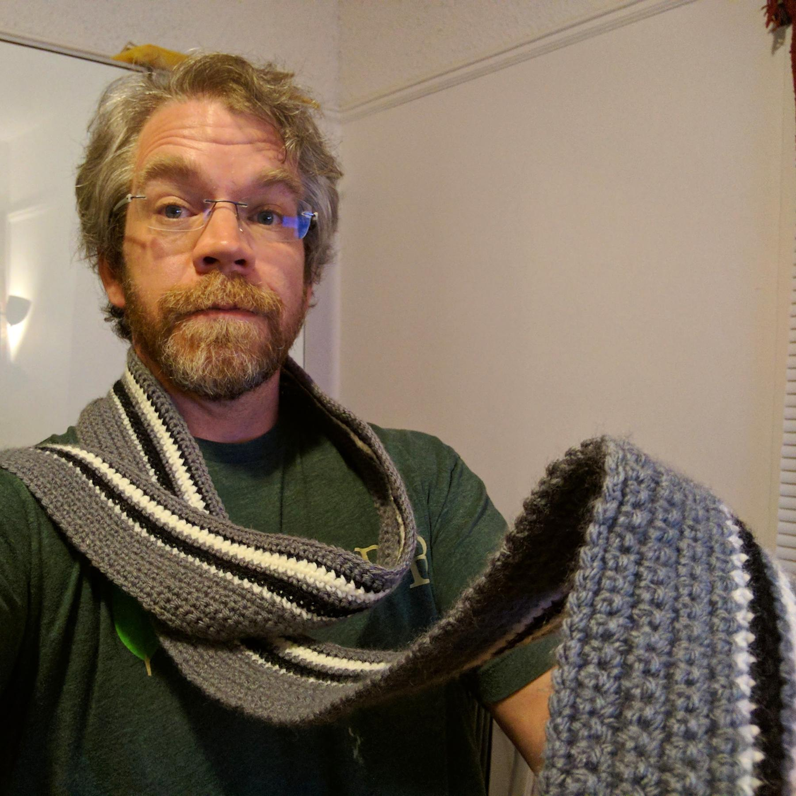

---
aliases:
- /craft/2017/my-stripes-and-stripes-scarf/
- /2017/07/06/my-stripes-and-stripes-forever-scarf/
category: post
date: 2017-07-06 00:00:00-07:00
slug: my-stripes-and-stripes-forever-scarf
syndication:
  twitter: https://twitter.com/brianwisti/status/883053925032644608
tags:
- crochet
- scarf
- craft
title: My Stripes (And Stripes) Forever Scarf
---

This is my version of the "Stripes (And Stripes) Forever Scarf" from [Stitch ’N Bitch Crochet: The Happy Hooker](https://www.goodreads.com/book/show/57512.Stitch_n_Bitch_Crochet). It came together quickly. The only real challenge was getting the first row of single chains in.

Someday I’ll stick exactly to a pattern. Today is not that day. Here are the things I intentionally changed.

* The pattern uses four colors, but I only had three I wanted to use for it
* I like longer scarves, so I added about six inches of length.
* I skipped the fringe. It did not move me.
