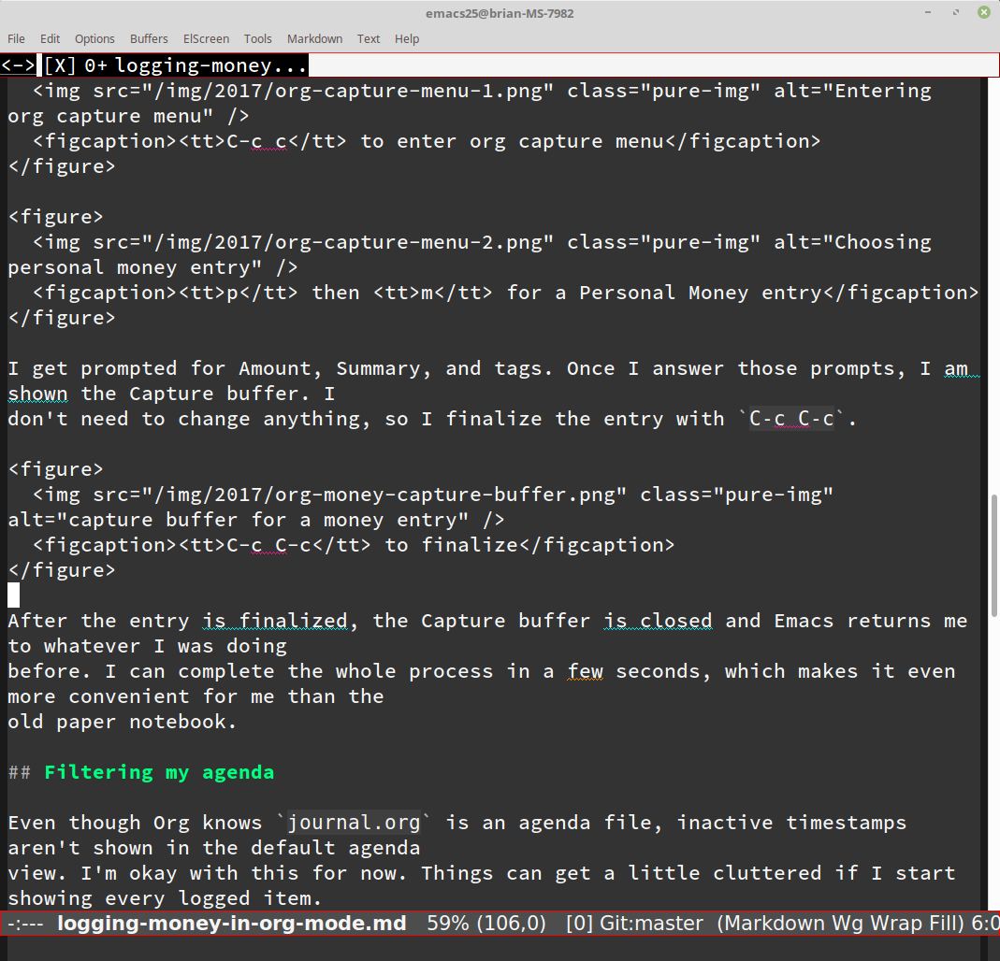

---
aliases:
- /post/2017/emacs-writegood-mode/
- /2017/08/06/emacs-writegood-mode/
category: post
date: 2017-08-06 00:00:00-07:00
slug: emacs-writegood-mode
syndication:
  twitter: https://twitter.com/brianwisti/status/894103914915667968
tags:
- emacs
- tools
title: Emacs Writegood Mode
---



I rushed through that post about [logging money](../07/logging-money-in-org-mode.md) in Org mode  and didn’t take much time to edit it. This bothers me. Today I went into [`writegood-mode`](https://github.com/bnbeckwith/writegood-mode) to catch my sloppiest writing mistakes.

 > 
 > **NOTE**
>
 > [card/Vim](../../../card/Vim.md) users may want to look at [`vim-wordy`](https://github.com/reedes/vim-wordy), a plugin with similar goals to `writegood-mode`.

## `writegood-mode`

`writegood-mode` is a minor [Emacs](../../../card/Emacs.md) mode which highlights troublesome patterns in your writing. It looks for three patterns:

weasel words
: a set of adverbs that add no meaning to the words they modify

passive voice
: sentences where the subject receives an action rather than performing it. Read this bit about [passive voice](https://www.hamilton.edu/academics/centers/writing/seven-sins-of-writing/1). They explain it better.

duplicated words
: "the the" is a common writing mistake, unless you’re talking about [the band](https://youtu.be/ustXRPke9lM)

`writegood-mode` used a collection of [bash scripts](http://matt.might.net/articles/shell-scripts-for-passive-voice-weasel-words-duplicates/) by [Matt Might](http://matt.might.net) for inspiration.

### Installing And Using It

Use the Emacs package manager to install `writegood-mode`.

M-x package-install writegood-mode

Enable it at any time with `M-x writegood-mode`. The documentation suggests you set a global command key to start `writegood-mode` more quickly, so I added that to `init.el`.

````elisp
(global-set-key (kbd "C-c g") 'writegood-mode)
````

### Adding a Hook

I must confess something to you. I installed `writegood-mode` months ago. I never remember to manually load it. Maybe add a hook to load it?

````elisp
(add-hook 'markdown-mode-hook 'writegood-mode)
````

This ensures that at least Markdown blog posts are automatically checked.

### Customizing Your Weasel Words

`writegood-weasel-words` contains a good starter collection of [words and phrases](https://github.com/bnbeckwith/writegood-mode/blob/master/writegood-mode.el#L92) to avoid. You can replace or extend this list with your own preferences.

````elisp
(setq bmw/weasel-words
      '("actually"
        "basically"
        "easily"
        "easy"
        "simple"
        "simply"))
(setq writegood-weasel-words
      (-concat writegood-weasel-words bmw/weasel-words))
````

Today I just take the take the original list as-is and add my own list of weasel words. [`-concat`](https://github.com/magnars/dash.el#-concat-rest-lists) from [`dash.el`](https://github.com/magnars/dash.el) returns the result of concatenating two lists into a single list.

 > 
 > **NOTE**
>
 > `dash.el` is an Emacs utility library that adds functions for examining and manipulating lists.
 > 
 > ````
 > M-x package-install dash
 > ````
 > 
 > Have fun!

### Readability Tests

`writegood-mode` provides [readability tests](https://github.com/bnbeckwith/writegood-mode#readability-tests) based on [Flesch-Kincaid](https://en.wikipedia.org/wiki/Flesch–Kincaid_readability_tests).

````elisp
(global-set-key (kbd "C-c C-g g") 'writegood-grade-level)
(global-set-key (kbd "C-c C-g e") 'writegood-reading-ease)
````

|Test|Score|
|----|-----|
|Flesch-Kincaid grade level score|4.98|
|Flesch-Kincaid reading ease score|77.68|

I write simply when possible, so these numbers please me. Readers can find highly technical writing at other sites.

## That’s It

Professional writers have professional editors. The rest of us do not. A tool like `writegood-mode` cannot replace a professional editor. However, by highlighting common patterns of lazy writing, it can help us pay attention to our words while we write them.

Excuse me. I need to edit that other post.