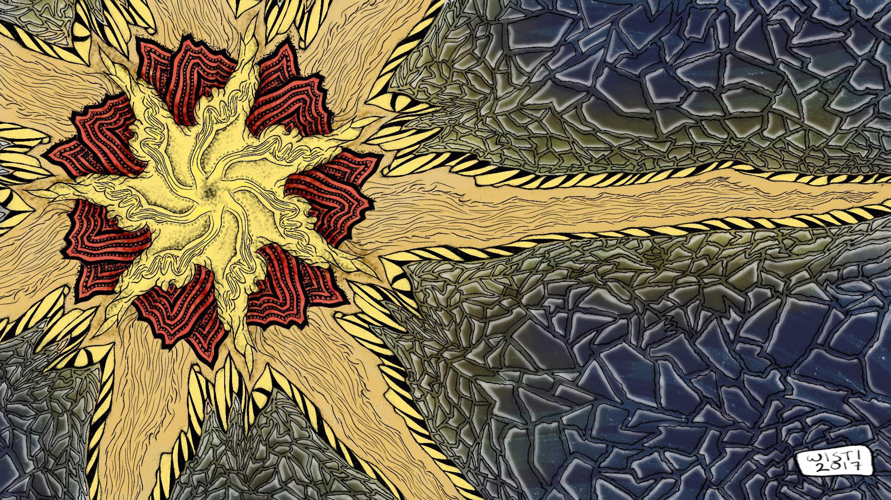

---
aliases:
- /craft/2017/a-desktop-background/
- /2017/09/03/a-desktop-background/
category: post
created: 2024-01-15 15:26:48-08:00
date: 2017-09-03 00:00:00-07:00
slug: a-desktop-background
tags:
- drawing
- procreate
- infinite-painter
- craft
title: A Desktop Background
updated: 2024-05-01 22:45:27-07:00
---

Thought I’d make a picture with the right aspect ratio for my desktop. Used
Infinite Painter’s radial symmetry tool for most of the linework, then over to
finish up with color and shade in Procreate.