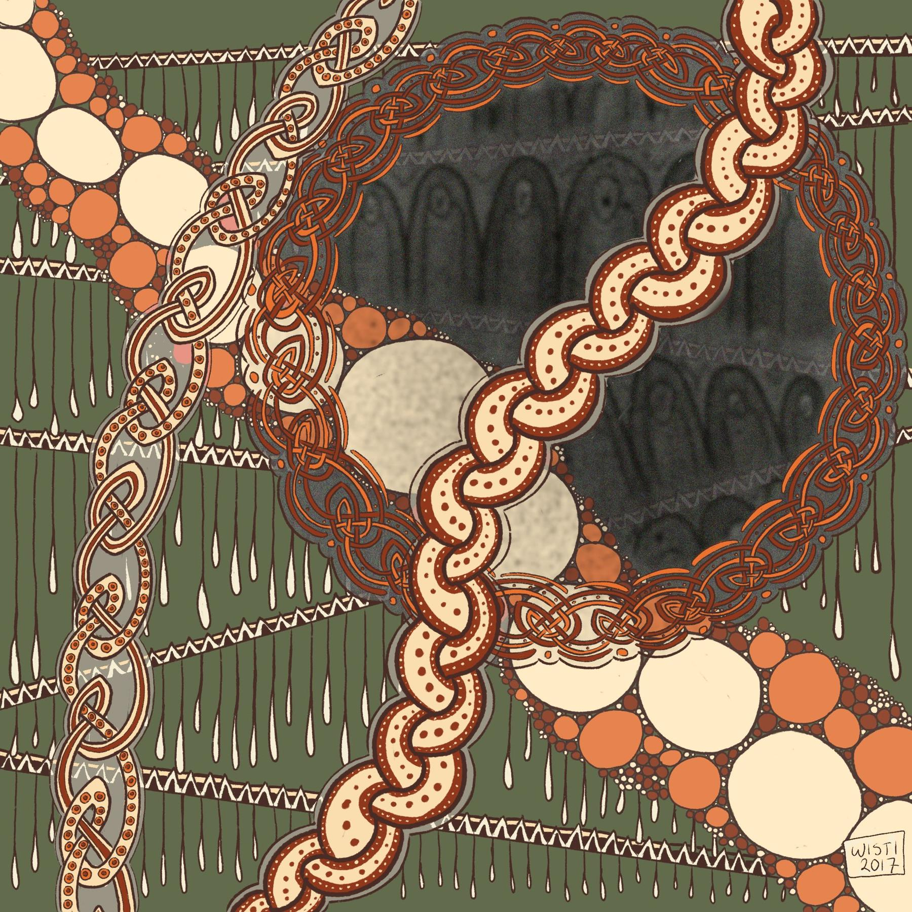

---
aliases:
- /2017/12/15/knotwork-practice/
- /post/2017/12/knotwork-practice/
category: post
date: 2017-12-15 00:00:00-08:00
slug: knotwork-practice
syndication:
  twitter: https://twitter.com/brianwisti/status/941831058193924096
tags:
- drawing
- procreate
- celtic
- zentangle
- craft
title: Knotwork Practice
---

This started with practicing a knotwork pattern from [Celtic Art: The Methods of Construction](https://www.goodreads.com/book/show/618205.Celtic_Art), and ended up as an exercise in how long I could add stuff before I got bored. Thirteen hours. Not bad.

Not in a row, of course.

Oh and I threw in a couple tangle elements from [The Tangles of Kells](https://www.goodreads.com/book/show/26311641-the-tangles-of-kells).

I might be ready to try drawing things on purpose again. Usually it’s just that my hands get itchy when I see blank space.
