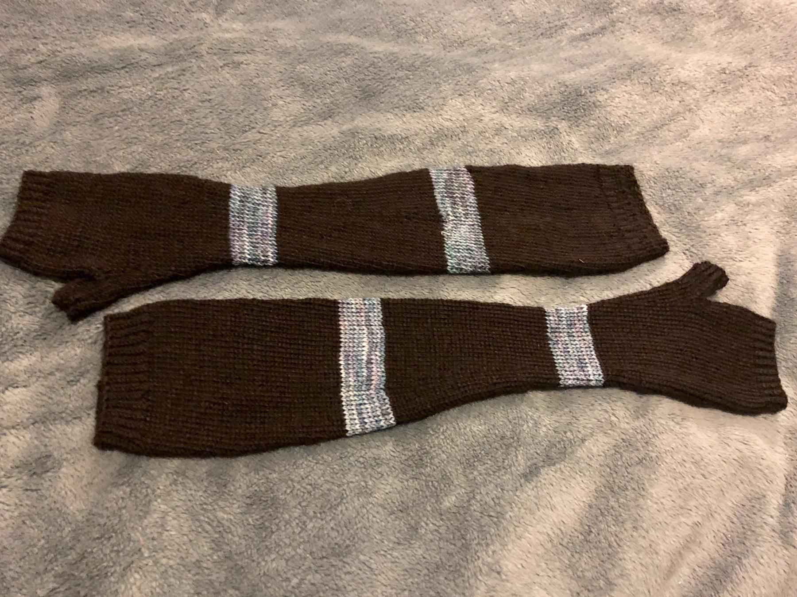

---
aliases:
- /2018/02/02/nicoles-fingerless-gauntlets/
category: post
created: 2024-01-15 15:26:51-08:00
date: 2018-02-02 00:00:00-08:00
slug: nicoles-fingerless-gauntlets
tags:
- knitting
- gloves
- craft
title: Nicole's Fingerless Gauntlets
updated: 2024-02-02 09:53:46-08:00
---

Still catching up with the backlog of finished knitting. Finished these a couple weeks ago.

Like [rainys-mish-mash-gloves](../../2016/03/rainys-mish-mash-gloves.md), these started from a fingerless gauntlet pattern in Sally Melville's [The Knitting Experience Book 2: The Purl Stitch](https://www.goodreads.com/book/show/24691.The_Knitting_Experience) I stayed closer to the original pattern this time, only adding a couple of stripes.

Impressively, I also managed to stay close to the recommended gauge. How? Went a size up on the needles. I tend to knit tight when working in the round. I used that tendency to my advantage in the next project, which I'll post about shortly.