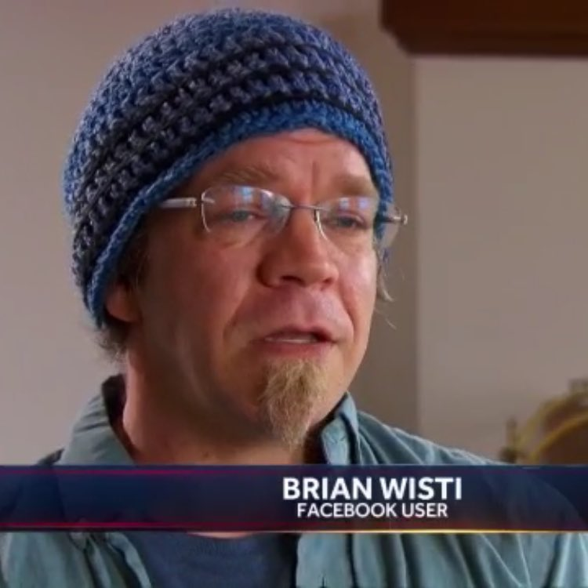

---
aliases:
- /2018/03/27/interviewed-about-facebook/
category: post
date: 2018-03-27 00:00:00-07:00
slug: interviewed-about-facebook
tags:
- links
- marginalia
- now
title: Interviewed About Facebook
created: 2024-01-15T15:26:45-08:00
updated: 2024-02-02T09:47:15-08:00
---

As mentioned [on Twitter](https://twitter.com/brianwisti/status/978439728226738176):

 > 
 > An hour and a half for a fifteen minute interview of which they used ten seconds for their two minute bit but OMG I'M ON TV
 > 
 > (and they finally stopped showing my number in the clear)

[interview link](https://www.nbcnews.com/nightly-news/video/ftc-launches-investigation-into-facebook-amid-new-allegations-of-data-collection-1195406915688)

<!--more-->

The interview mainly provided a "Facebook User" reaction to news about Facebook [logging text and call metadata](https://www.theguardian.com/technology/2018/mar/25/facebook-logs-texts-and-calls-users-find-as-they-delete-accounts-cambridge-analytica) on Android devices, which got more attention thanks to people checking their data after the currently most recent [Cambridge Analytica](https://www.engadget.com/2018/03/19/facebook-and-cambridge-analytica-nightmare/) scandal. I tell you what: my friends who never joined Facebook are feeling justifiably smug.

Alas, my awkward attempts to plug [Mastodon](https://joinmastodon.org/), [Signal](https://www.signal.org/), and [Telegram](https://telegram.org/) went nowhere.

The East Coast feed included a clear shot of my phone number on the Messenger screen. That led to some amusing texts — and phone calls, but I never answer my phone so that had no impact. They edited that overshare after a couple hours and the texts stopped.

Most importantly, I got an awful new profile image for FB and Twitter — thanks to a Twitter friend sending the suggestion with a particularly choice screenshot —  *and* I got to show off my [Boy Beanie](my-replacement-boy-beanie.md) on national news.
