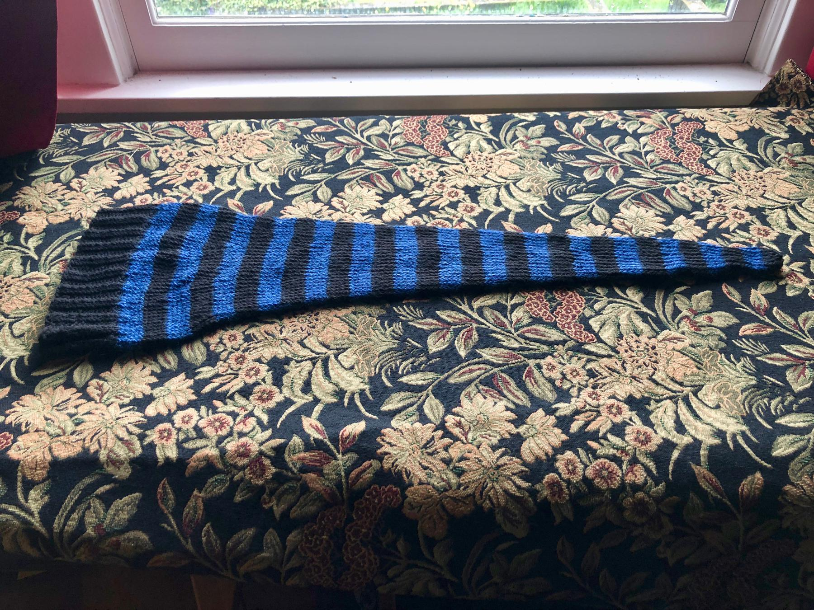

---
aliases:
- /2018/04/27/stocking-cap/
category: post
created: 2024-01-15 15:26:43-08:00
date: 2018-04-27 00:00:00-07:00
description: I knitted myself a slightly silly stocking cap which I quite enjoy.
slug: stocking-cap
tags:
- knitting
- hat
- craft
title: Stocking Cap
updated: 2024-05-02 07:31:52-07:00
---

* To get a comfortable fit, I cast on 84 instead of the [original](http://www.knittingonthenet.com/patterns/hatlongstockingcap.htm) pattern’s 78.
* To produce a slightly shorter hat, I decreased every 15 stitches instead of every 20.

