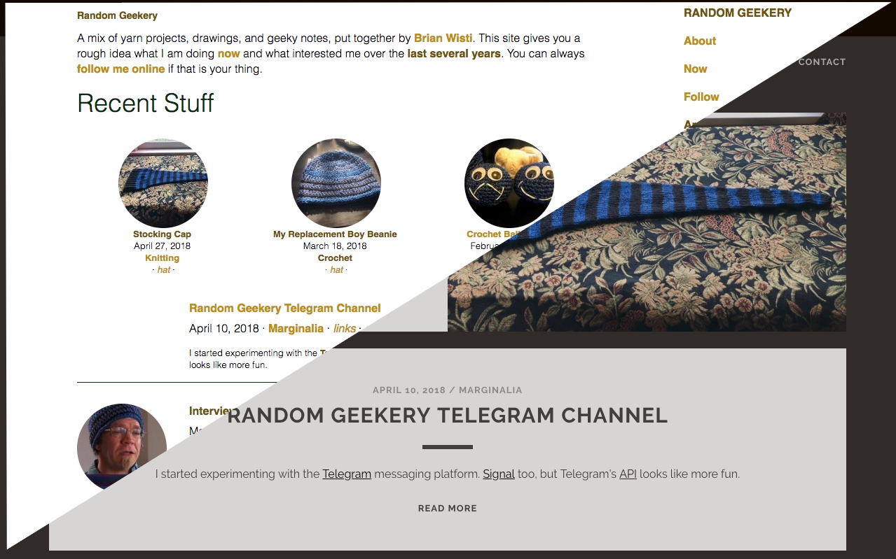

I adapted the [Nederburg](https://github.com/appernetic/hugo-nederburg-theme) theme for my [card/Hugo](../../../card/Hugo.md) site. I probably won't keep it but I'll darn well use it for a bit.

<!--more-->

There are many bits that I like but it feels heavy for my taste. I enjoyed making things work within my own quirky taxonomy. Maybe I'll try a different theme later – Hugo has [many themes](https://themes.gohugo.io/). Maybe I'll try harder at making my own since I'm so fussy.
