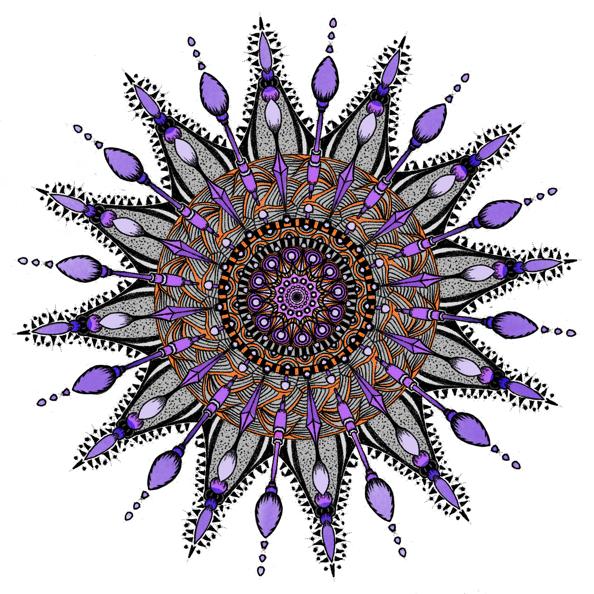

---
aliases:
- /post/2018/06/buy-my-stuff-at-design-by-humans/
category: post
created: 2024-01-15 15:26:45-08:00
date: 2018-06-12 00:00:00-07:00
slug: buy-my-stuff-at-design-by-humans
tags:
- drawing
- infinite-painter
- hugo
- buy-me
- craft
title: Buy My Stuff At Design by Hümans
updated: 2024-02-01 19:57:58-08:00
---

I opened a [store](https://www.designbyhumans.com/shop/randomgeek/) on the Design by Hümans site! I also made [Hugo](../../../card/Hugo.md)  warn me when I forget purchase links.



Well, one design. I only got things going yesterday, with a quick sketch on a plain white background. Future plans include adjusting old designs and creating new ones for the store, with an intended pace of roughly one design per week.

Of course I already worked out the site integration. Everything on Random Geekery tagged "buy me" should have a direct link to its page on the store. I get a lovely Hugo [`errorf`](http://gohugo.io/functions/errorf/) message if I forget the link.

````
{{- if in .Params.tags "buy me" -}}
  {{- if isset .Params "purchase" -}}
    {{- with .Params.purchase -}}
      <p class="cover-link">
        <a href="{{ .url }}" target="_blank">{{ .caption }}</a>
      </p>
    {{- end -}}
  {{- else -}}
    {{ errorf "%s Tagged 'buy me' without purchase front matter!" .File.Path }}
  {{- end -}}
{{- end -}}
````

My partial is a little clunky, but it worked. I can improve it later.