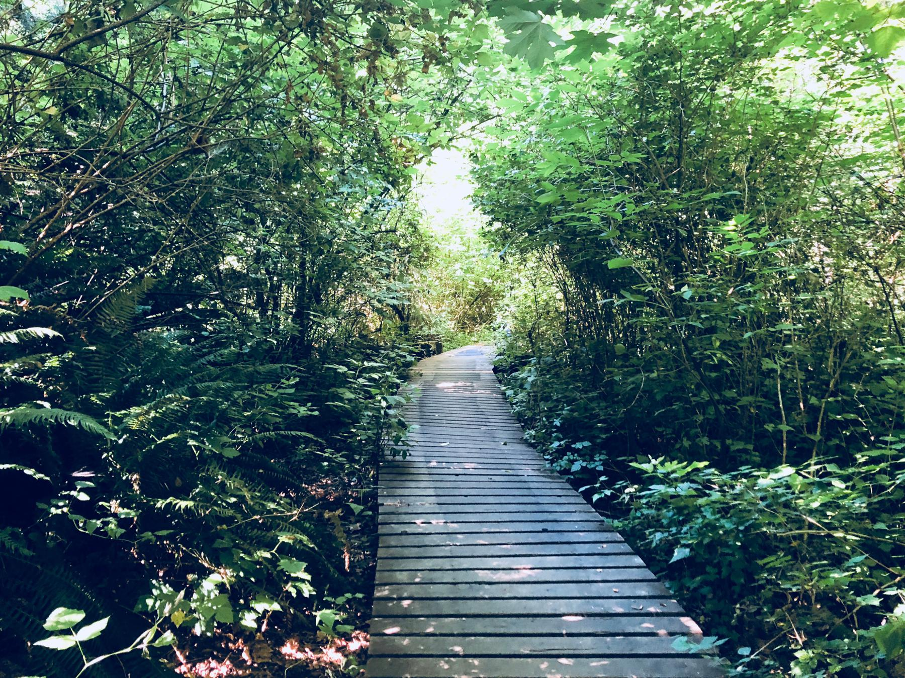

---
aliases:
- /2018/07/08/fauntleroy-park/
category: post
created: 2024-01-15 15:26:43-08:00
date: 2018-07-08 00:00:00-07:00
series:
- sauntering
slug: fauntleroy-park
tags:
- exploring
- sauntering
- marginalia
title: Fauntleroy Park
updated: 2024-05-01 22:47:12-07:00
---

Today I explored [Fauntleroy Park](http://fauntleroywatershed.org/), a 28 acre park in West Seattle with some nice trails.

<!-- more -->

Years ago, I had a regular habit of exploring local parks and trails. Not *hiking*, mind you. Ugh. That sounds too purposeful for a person like me. No, [sauntering](/tags/sauntering). I just wanted to wander around, seeing what interests me, and enjoying the little differences each park offered.

You know what? It’s past time to start that habit back up.

Fauntleroy Park is smaller than nearby [Lincoln Park](https://www.wta.org/go-hiking/hikes/lincoln-park), but I wanted someplace new to me.

I enjoyed following the park’s trails. Green, lush, and very local. [Sword ferns](http://www.nwplants.com/business/catalog/pol_mun.html) everywhere! It left me feeling a bit nostalgic for the [green belts](https://en.wikipedia.org/wiki/Green_belt) that have been steadily disappearing from the Pacific Northwest as we make room for more people.

The city is unavoidable. I could hear traffic at every point in the park. I found myself accidentally outside the park a few times in my brief visit. If you’re not careful some of the smaller trails will lead you to someone’s back yard. That makes me even more impressed by how much work has gone into maintaining the watershed in the middle of a busy city’s residential neighborhoods. Volunteers and students maintain the space, keeping it safe for salmon spawning, barred owls, and other critters.

And if you give nature half a chance, things start growing absolutely any place they can.

Still – I think next time I may want to venture a little further out. Seattle has many parks and trails, but I have visited the longer trails within the city many times over the years. The [Washington Trails Association](https://www.wta.org/) provides resources for the aspiring saunterer, including an [interactive map](https://www.wta.org/go-outside/map) of trails across Washington State.