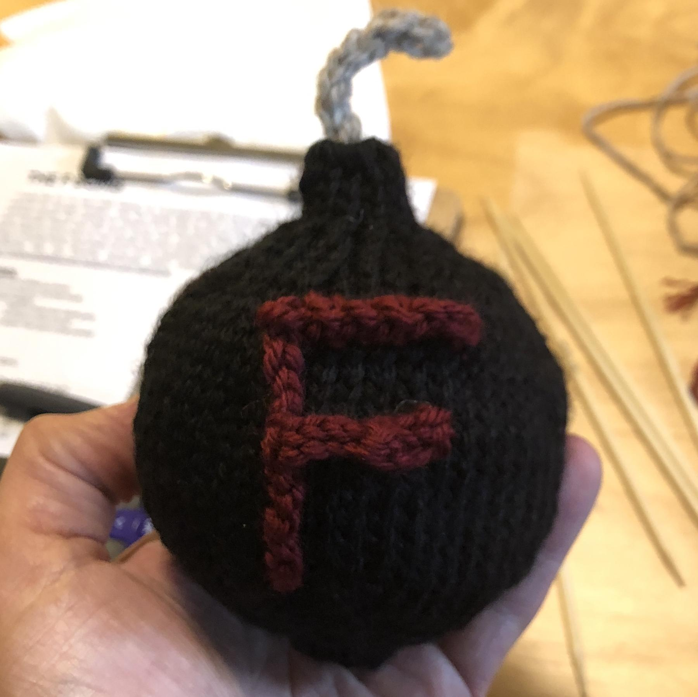

---
aliases:
- /2018/07/01/my-first-f-bomb/
category: post
date: 2018-07-01 00:00:00-07:00
slug: my-first-f-bomb
tags:
- knitting
- crochet
- craft
title: My First F Bomb
---

Took a break this weekend *inbox/Knitting* a quick yarn project.

<!--more-->

The [original pattern](https://www.ravelry.com/patterns/library/the-f-bomb) uses [duplicate stitch knitting](https://www.wikihow.com/Knit-the-Duplicate-Stitch) for the letter, but after a couple frustrated hours I gave up on that and crocheted the letter on. I expect to make more of these. The lettering should improve.
