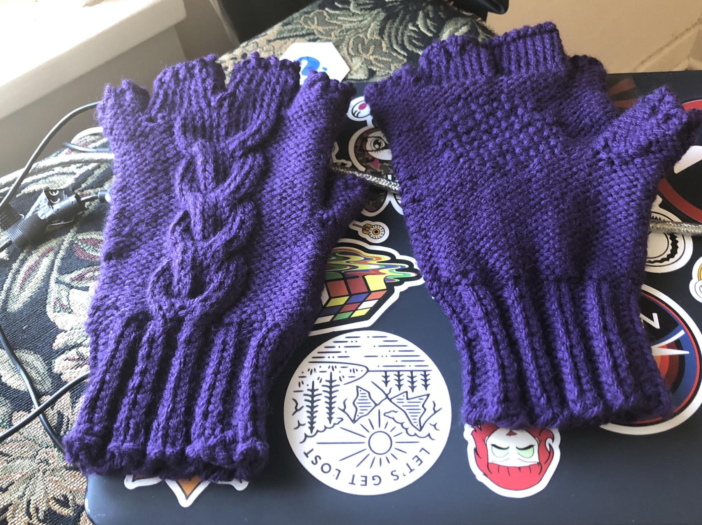

---
aliases:
- /2018/08/04/beer-gloves/
category: post
date: 2018-08-04 00:00:00-07:00
slug: beer-gloves
tags:
- knitting
- gloves
- craft
title: Beer Gloves
---

I knitted a pair of the fingerless Beer Gloves from [Son of Stitch 'n Bitch](https://www.goodreads.com/book/show/170305.Son_of_Stitch_n_Bitch). This involved a couple new techniques and several new mistakes.

<!--more-->

These gloves have a nice cable along the back. A seed stitch patch near the palm supposedly helps with opening bottles. I have not tested them for opening bottles yet, but the texture feels nice and gives a bit more grip than the reverse stockinette alone.

The pattern called for double-pointed needles. I tried something new instead, and knit this using the [magic loop](https://www.craftsy.com/knitting/article/demystifying-the-magic-loop/) method with a single circular needle. It worked well until the thumbs and fingers. It's kind of easy to get yourself going in the wrong direction if you aren't careful. I accidentally knit one thumb pointing almost straight out, instead of the slight angle of its mate.

Since my purl gauge tends to be loose, the reverse stockinette that dominates this pattern produced a bulkier glove than I would have liked. If I make these again with the same [Impeccable Solids](https://www.ravelry.com/yarns/library/loops--threads-impeccable-solids) yarn, I should use slightly smaller needle than the pattern calls for. And I probably won't use magic loop, either.

The [invisible ribbed bind off](https://knitfreedom.com/invisible-ribbed-bind-off/) took me a few tries to get right. Fortunately, I had ten opportunities to learn. Even more fortunately, the recipient of these gloves finds the loose yarn loops of failure to be charming.

Enough nitpicking! These are good gloves. They keep their wearer warm while keeping fingers free for fine motor skills. The cable is gorgeous. These are destined for a friend, who already loves them and will wear them enthusiastically once the weather gets cold enough.

## What next?

I enjoyed making these, but I want to learn more about glove construction in general instead of haphazardly implementing cool-looking patterns. I have several simple mitten and glove ideas planned!
