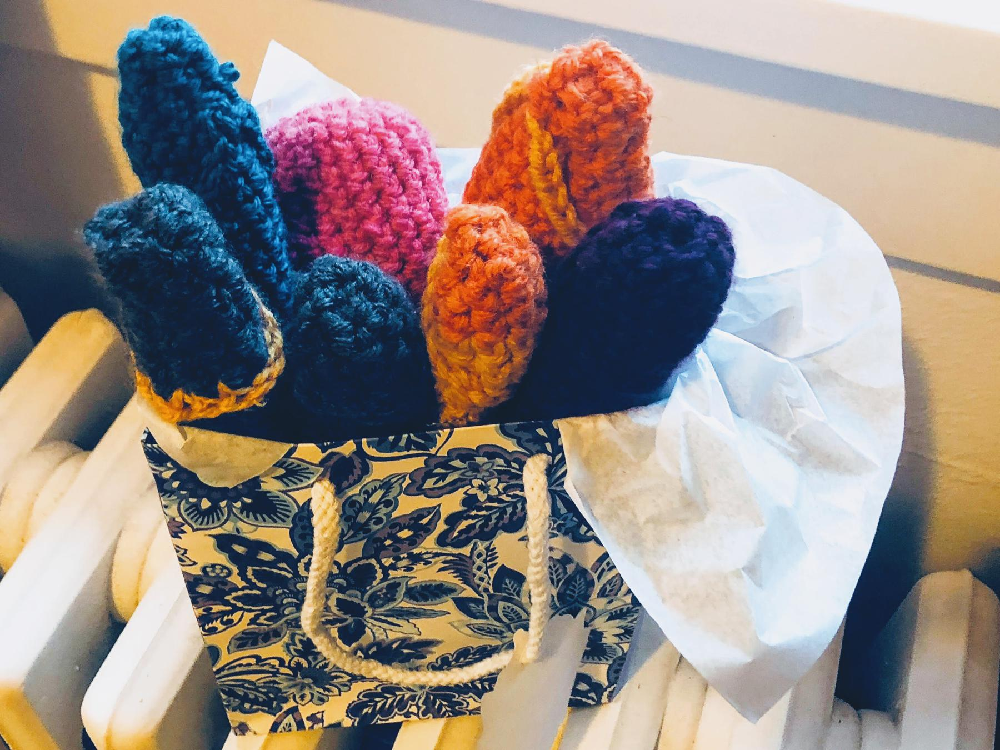

---
aliases:
- /2018/08/26/potholders/
category: post
created: 2024-01-15 15:26:44-08:00
date: 2018-08-26 00:00:00-07:00
description: Yes, they look like that on purpose.
slug: potholders
tags:
- crochet
- craft
title: Potholders
updated: 2024-02-01 21:57:40-08:00
---

A friend asked me to *Crochet* a potholder based on an image she saw online. I tracked the image down to its source: the "ManHandle Pot Holder" on Margaret Calver’s [ayarnnut](https://www.etsy.com/shop/ayarnnut) Etsy store.

The pattern wasn’t too hard to figure out. I made several potholders as I worked through the process.

* chain a few - I settled on four
* increase at a pace you like until you reach the desired circumference
* single chain around until you reach the desired length
* single chain some texture where it looks about right

This description is deliberately vague because I made each potholder different, both for fun and because the natural world is full of variety.

I shared images of the collection as I worked on it. Some people — okay, some *guys* — presented surprising ideas for the intended usage. This is not a penis sweater. If nothing else, think of the chafing. And related to their bold claims about needing one that was significantly longer: you don’t want excess material flopping uselessly. That’s a safety hazard.

The potholder fits over the pot handle like so.

But you do you.

Want one? Crochet it yourself! Don’t want to do that? [Buy one](https://www.etsy.com/shop/ayarnnut) so the genius who came up with this idea gets some money!