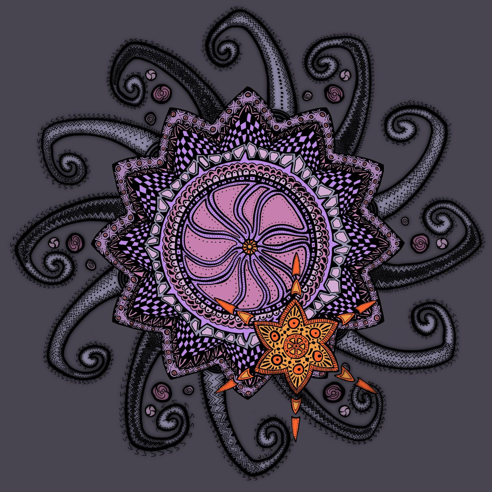

---
aliases:
- /2018/08/11/satellite/
category: post
created: 2024-01-15 15:26:45-08:00
date: 2018-08-11 00:00:00-07:00
slug: satellite
tags:
- drawing
- sketchbook-mobile
- procreate
- buy-me
- craft
title: Satellite
updated: 2024-05-02 07:33:00-07:00
---

This one took a while.

<!--more-->

I found a quick symmetry doodle in Sketchbook from a month or two ago, turned off symmetry, then spent about a week and a half reworking the lines and adding "just one more bit." Switch over to Procreate for a couple hours of touchups, because I prefer the feel of Procreate's brushes.

Finally forced myself to stop and post this. It is too easy to keep going until you lose steam and end up with an overwhelmingly intricate but *unfinished* work.