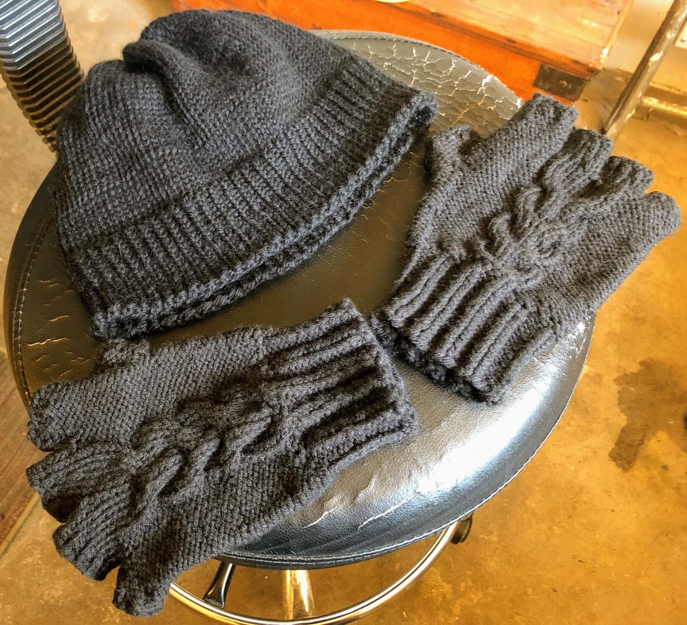

---
aliases:
- /2018/10/27/winter-hat-and-gloves/
category: post
date: 2018-10-27 00:00:00-07:00
slug: winter-hat-and-gloves
tags:
- knitting
- hat
- gloves
- craft
title: Winter Hat and Gloves
---

I made  myself a hat and gloves in matching colors for winter.

<!--more-->

The gloves use the same [Son of Stitch 'n Bitch](https://www.goodreads.com/book/show/170305.Son_of_Stitch_n_Bitch) pattern as the [purple beer gloves](../08/beer-gloves.md) I knitted this summer. This pair turned out much better. Learning through repetition! However, that Loops & Threads "Impeccable" yarn is far too stiff for gloves. I would prefer a sportweight blend to this worsted weight acrylic for things that need to move with my hands.

I lost the label for the hat yarn but it's probably Patons North America Classic Wool Worsted. So soft and cozy on my head. I accidentally changed tension once I picked up speed, resulting in an interesting gauge effect along the bottom ribbing, but that is already becoming less pronounced with wear. You can also see twisted stiches where I recovered a row but mounted those stitches incorrectly. This happened plenty of times in the past, but I wanted to remember these little mistakes for future projects.

This isn't me being overly fussy. It's just me moving past the beginner mode of "Yay I finished something!" to hopefully more intermediate habits that ask "how will I do better next time?"

The hat pattern came from [The Knitter's Handy Book of Patterns](https://www.goodreads.com/book/show/85015.Knitters_Handy_Book_Of_Patterns) by Ann Budd. As I get more comfortable with knitting, my interests move from specific patterns to templates and techniques. This book seems a good step in that direction so far. Quite a few tables and charts, which calls out to old memories of gaming books. The tables are just math helpers though. I can see not needing them after a certain point. That's the day I'll be able to knit custom fit stuff from memory. Something to look forward to!
