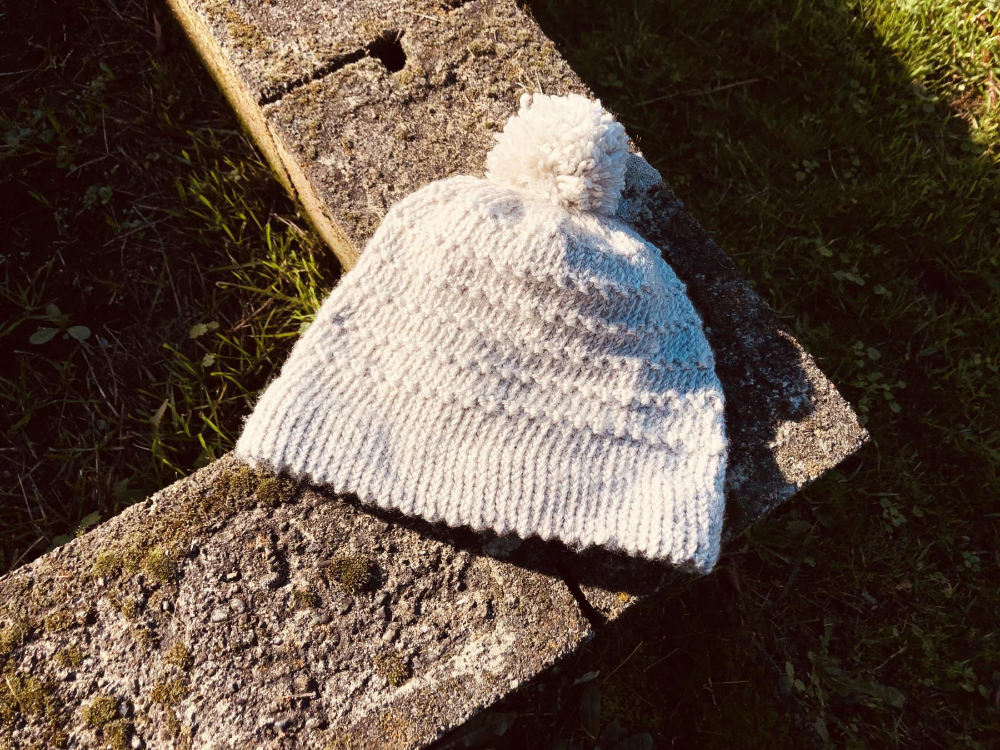

---
aliases:
- /2018/11/20/basic-hat-with-picot-edge/
category: post
date: 2018-11-20 00:00:00-08:00
description: I continue building my hat knitting knowledge!
slug: basic-hat-with-picot-edge
syndication:
  twitter: https://twitter.com/brianwisti/status/1065109705507319808
tags:
- knitting
- hat
- craft
title: Basic Hat With Picot Edge
created: 2024-01-15T15:26:44-08:00
updated: 2024-02-01T22:07:52-08:00
---

This hat is another round of the "basic hat" from Ann Budd’s [The Knitter’s Handy Book of Patterns](https://www.goodreads.com/book/show/85015.Knitters_Handy_Book_Of_Patterns). This time I used a picot edge, which adds texture to [basic-hat-with-hemmed-edge](basic-hat-with-hemmed-edge.md).

The picot edge was so satisfying that I decided to add a couple more new techniques. First was the Roman stitch on the hat body, which came from [A Treasury of Knitting Patterns](https://www.goodreads.com/book/show/129506.A_Treasury_of_Knitting_Patterns). The pattern instructions from the book are for knitting flat. I adapted them for knitting in the round.

Rows 1-4
: `K` to end

Row 5
: `K1,P1` to end

Row 6
: `P1,K1` to end

I wasn’t done with new stuff, though. I decided it was time for my first pom pom. Wandered off to YouTube to see the process in action.

I needed to see someone making a pom pom.

<iframe width="560" height="315" src="https://www.youtube.com/embed/8ilFeg7dPIU" title="YouTube video player" frameborder="0" allow="accelerometer; autoplay; clipboard-write; encrypted-media; gyroscope; picture-in-picture" allowfullscreen></iframe>

Finally, I realized I also needed to see someone attach a pom pom to a hat. The hat in the video is crochet, but the principle is the same.

<iframe width="560" height="315" src="https://www.youtube.com/embed/aiRQb5JkjzE" title="YouTube video player" frameborder="0" allow="accelerometer; autoplay; clipboard-write; encrypted-media; gyroscope; picture-in-picture" allowfullscreen></iframe>

After all that, the hat came out quite nice. It fit my head comfortably. The pom pom stays securely attached. The Roman Stitch feels nice when I rub my hands on the hat.

So naturally I’m taking the hat down to the post office tomorrow to ship off for a friend. Their head has the same circumference as mine. At this point, I worry less about the fate of my projects. I can make more.
