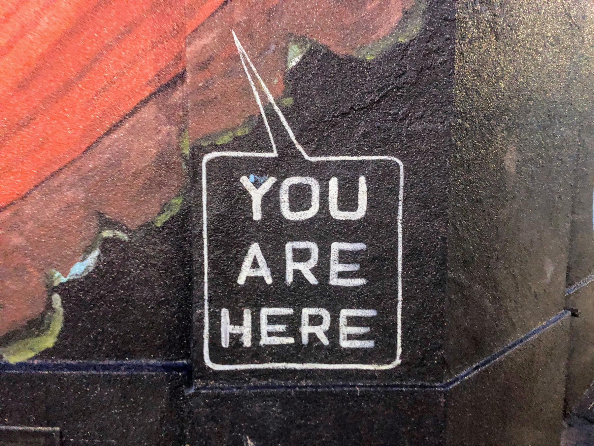

---
aliases:
- /2018/12/31/hopepunk-for-2019/
category: post
created: 2024-01-15 15:26:42-08:00
date: 2018-12-31
slug: hopepunk-for-2019
tags:
- personal
- marginalia
title: Hopepunk for 2019
updated: 2024-03-11 11:22:26-07:00
---

Writing these late night thoughts is as close as I get to making resolutions.

<!--more-->

Lots of copying and pasting in this, since getting the words in full is important to me.

Tonight on Facebook, a friend shared a [Tumblr post](http://heartlessharless.tumblr.com/post/133490414240/alycs-being-unconditionally-polite-kind-and).

 > 
 >  > 
 >  > Being unconditionally polite, kind, and compassionate in a society that values and finds “deeper meaning” in aloofness and cynicism is subversive and thus punk
 > 
 > hufflepunk

This has been my own general philosophy. Best to make it explicit. Values fade if kept in the shadows.

Anyways, "hufflepunk" sounds an awful lot like [hopepunk](https://ariaste.tumblr.com/post/163500138919/ariaste-the-opposite-of-grimdark-is-hopepunk).

 > 
 >  > 
 >  >  > 
 >  >  > The opposite of grimdark is hopepunk. Pass it on.
 >  > 
 >  > \#this is a good post #also I need an example of hopepunk #bc the name #resonates with me #and I need it
 >  > \#please #if you don’t mind (via @-lavender-starling)
 > 
 > So the essence of grimdark is that everyone’s inherently sort of a bad person and does bad things, and that’s awful and disheartening and cynical. It’s looking at human nature and going, “The glass is half empty.”
 > 
 > Hopepunk says, “No, I don’t accept that. Go fuck yourself: The glass is half-full.”  YEAH, we’re all a messy mix of good and bad, flaws and virtues. We’ve all been mean and petty and cruel, but (and here’s the important part) we’ve also been soft and forgiving and KIND. Hopepunk says that kindness and softness doesn’t equal weakness, and that in this world of brutal cynicism and nihilism, being kind is a *political act*. An act of *rebellion.*
 > 
 > Hopepunk says that *genuinely and sincerely* caring about something, anything, requires bravery and strength. Hopepunk isn’t ever about submission or acceptance: It’s about standing up and fighting for what you believe in. It’s about standing up for other people. It’s about DEMANDING a better, kinder world, and truly believing that we can get there if we care about each other as hard as we possibly can, with every drop of power in our little hearts.

There's more, but I don't need to paste the *entire* post.

Looking up Hopepunk led me to [this Vox article](https://www.vox.com/2018/12/27/18137571/what-is-hopepunk-noblebright-grimdark), which does a fine job breaking it down so I don't have to.

 > 
 > Through this framing, the idea of choosing hope becomes both an existential act that affirms your humanity, and a form of resistance against cynical worldviews that dismiss hope as a powerful force for change.

Let's see, what other examples can I think of? Oh, I know: [Mister Rogers](http://www.pbs.org/parents/rogers). You could throw a dart at a wall of Fred Rogers quotes and anything it hit would be appropriate for hopepunk. The man fully understood the world he was speaking to.

 > 
 > Some days, doing "the best we can" may still fall short of what we would like to be able to do, but life isn't perfect on any front — and doing what we can with what we have is the most we should expect of ourselves or
 > anyone else. — [Fred Rogers](https://www.azquotes.com/quote/895495)

The thing about all of these is that you don't expect the world to magically become a better place through your efforts. You do them because that's how things should be, and if we see someone stubbornly refusing to submit to cynicism, it might give us a little strength for our own efforts. If nothing else, we can sleep a little more easily with ourselves at night.

So I intend to be more explicitly this in 2019.

And — you know. If you don't like it, fuck off. I love you anyways.