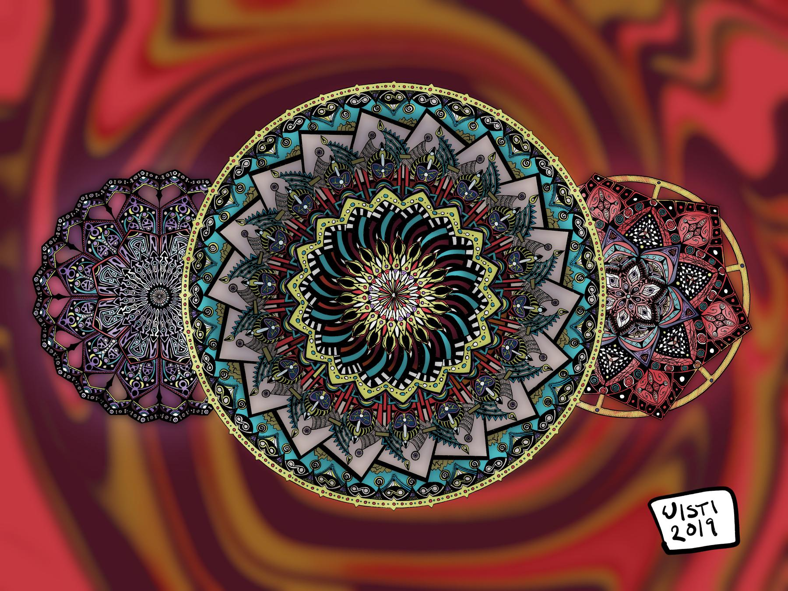

---
aliases:
- /2019/02/05/three-circles/
category: post
created: 2024-01-15 15:26:35-08:00
date: 2019-02-05 00:00:00-08:00
slug: three-circles
tags:
- drawing
- procreate
- buy-me
- craft
title: Three Circles
updated: 2024-02-02 10:03:39-08:00
---

That [circle template](../01/circular-grids-with-python-and-pillow.md) I mentioned a couple weeks ago? Well, I made it so I could draw stuff like this!

<!--more-->

Spent about a month on it, an hour or so at a time. Will I do it again? Of course! Will I do it regularly? Who knows? It took more patience than I'm used to, and I still haven't decided how much I like it.

I enjoyed figuring out the templates with code and then building on them manually. I also have ideas for some Celtic style images.

But first I need to get back to preparing a work talk.