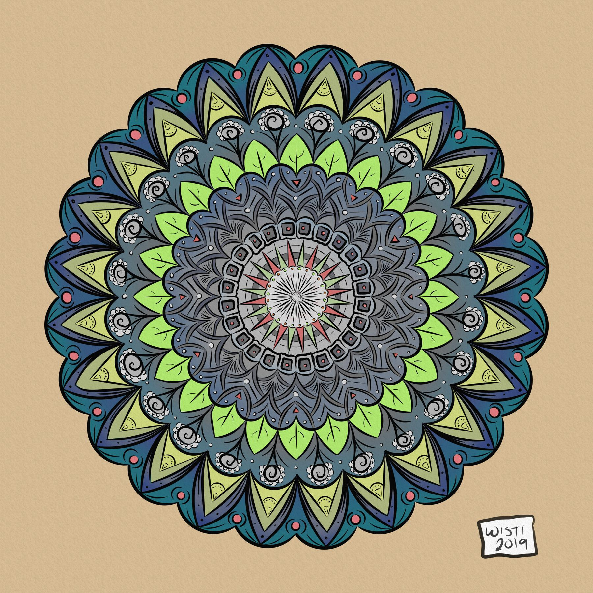

---
aliases:
- /2019/03/19/garden-mandala/
category: post
date: 2019-03-19 00:00:00-07:00
slug: garden-mandala
syndication:
  mastodon: https://hackers.town/@randomgeek/101781261652356567
  twitter: https://twitter.com/brianwisti/status/1108232025503195138
tags:
- drawing
- infinite-painter
- buy-me
- craft
title: Garden Mandala
created: 2024-01-15T15:26:34-08:00
updated: 2024-02-02T09:41:40-08:00
---

A Samsung Note 9 means my phone drawing has been upgraded.

<!--more-->

I feel like I neglected the blog this year. That's probably because of the half dozen draft posts I still need to finish. Also, I've been busy working, drawing, learning, and even — *gasp* — socializing!

One of the big moments for me? Well, aside from dancing in public, which I hadn't done in well over a decade? The purchase of a Samsung Galaxy Note 9. Refurbished, because if I can save a few bucks I will. Drawing on it is a delight, pretty much. Not *quite* as smooth as iPad + Pencil, but far better than using a capacitive stylus on other phones. Overall, the Note takes me back to the days of having a small sketchbook with me at all times.

The Note is Android, which means I could install [Syncthing](https://syncthing.net/) on it and grab a [circle template](../01/circular-grids-with-python-and-pillow.md) from my desktop. My first serious sketch with the Note was of course another manual symmetry doodle.

The Note's specs meant that I could have many layers for relatively large images (this one is 4084x4084 pixels) and still get a smooth drawing experience. I like the end result, too.

I kind of want to take a break from the super detailed symmetry drawings,  though. Seems like that's all I've been doing lately! Maybe practice some cartoon style doodles. Pull out the Mark Kistler books if I have to.

Oh, and I should finish those draft posts at some point.
