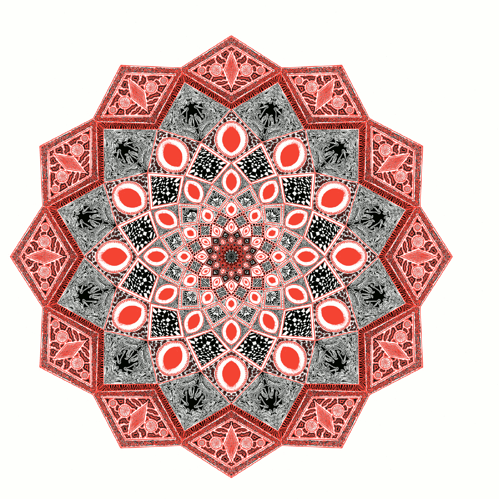

---
aliases:
- /2019/04/14/psychedelic-playing-card/
- /post/2019/04/psychedelic-playing-card/
category: post
date: 2019-04-14 00:00:00-07:00
slug: psychedelic-playing-card
syndication:
  mastodon: https://hackers.town/@randomgeek/101928306169432164
  twitter: https://twitter.com/brianwisti/status/1117646166508883968
tags:
- drawing
- infinite-painter
- symmetry
- craft
title: Psychedelic Playing Card
---

That cover image is kinda fuzzy. Better click on the original link image to see it properly.

<!--more-->

The result of a couple weeks of bedtime doodling.

Sometimes drawing constraints are fun: one layer. Two colors. One brush. Undo okay, changing brush size okay.