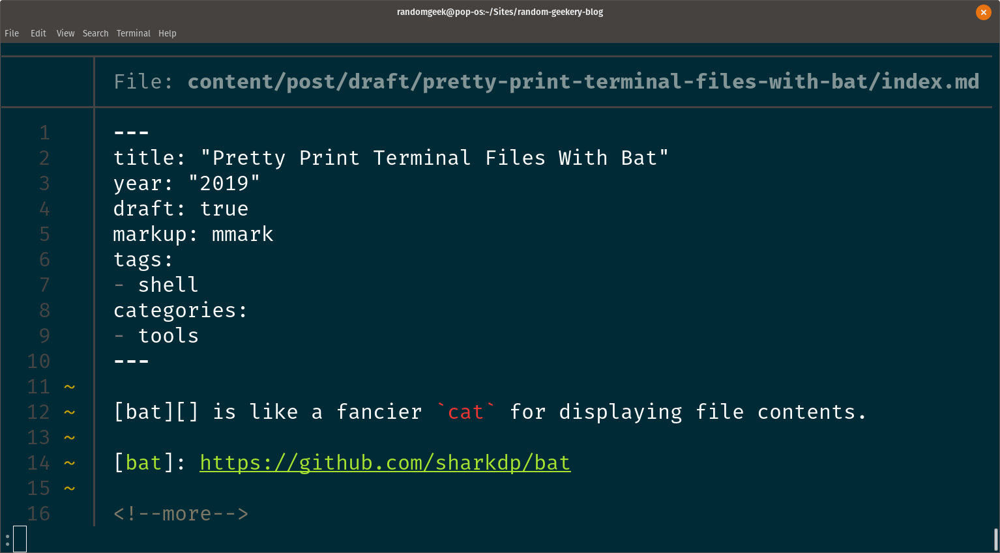

---
aliases:
- /2019/05/24/pretty-print-terminal-files-with-bat/
category: post
created: 2024-01-15 15:24:39-08:00
date: 2019-05-24 00:00:00-07:00
description: '`bat` is like a fancier `cat` for displaying file contents.

  '
slug: pretty-print-terminal-files-with-bat
syndication:
  mastodon: https://hackers.town/@randomgeek/102153562058385171
  twitter: https://twitter.com/brianwisti/status/1132062293209092098
tags:
- shell
- tools
title: Pretty Print Terminal Files With Bat
updated: 2024-04-14 09:44:34-07:00
---



My work routine lately includes automatic generation of SQL files for database updates. That routine includes quickly skimming them to find obvious errors. I wanted something quicker than reviewing them in my editor, but fancier than the simple plain text of `cat`.

I have the [Pygments](http://pygments.org/) syntax highlighting library for [Python](../../../card/Python.md) installed, so I could use `pygmentize` piped to `less` for paging:

````sh
pygmentize -g work.sql | less -NR
````

However, that is noticeably slow and most definitely not convenient. Adding an alias helped the convenience, but did nothing for the sluggishness.

[bat](https://github.com/sharkdp/bat) provides what I need. It runs quick enough that I don’t need to think about it, highlights code, numbers lines, indicates git changes in the margin, and feeds the result to `less` if there’s more than you can display on one screen.

Packages are available for several Linux distributions, or you can install it via [Homebrew](https://brew.sh/) (reminder: Homebrew works on macOS *and* Linux these days).

````
$ brew install bat
````

Sometimes I need to check the structure of files where whitespace matters: tab-delimited files, Makefiles, Python, stuff like that. `bat -A` shows whitespace and other non-printable characters displayed, though you lose syntax highlighting.


## Plain Text

I enjoy the formatting conveniences from `bat` even when examining plain text files.


This is all I’ve needed `bat` for, but it’s flexible enough to work into your everyday shell just like `cat`. Check out the [README](https://github.com/sharkdp/bat) for ideas.