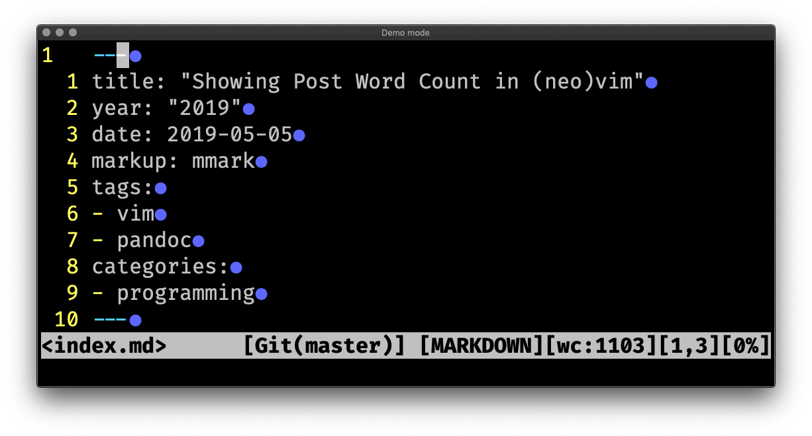

---
aliases:
- /2019/05/05/showing-post-word-count-in-neovim/
category: post
date: 2019-05-05 00:00:00-07:00
slug: showing-post-word-count-in-neovim
syndication:
  mastodon: https://hackers.town/@randomgeek/102046653899640488
  twitter: https://twitter.com/brianwisti/status/1125220640640962566
tags:
- vim
- pandoc
- programming
title: Showing Post Word Count in (neo)vim
---

A couple shell pipes. A little Vimscript. Now [card/Neovim](../../../card/Neovim.md) tells me (roughly) how many words my post has!

<!--more-->



## My problem

[once again](../../2014/10/counting-words-in-blog-posts.md) I'm trying to get myself to write more regularly. I post so much everywhere else. Surely I can spare a few hundred words a week on my blog, right?

Since I implied a number in that question, I have a metric I can use. Word count! Just write until I have 250 words, then post it. Or five hundred. Or a thousand. Whatever. I don't even need a concrete goal.  Seeing the number encourages me to type a little bit more.

But how to get the word count of a post? The approach I used a few years ago required enough extra thought that I eventually forgot all about it until editing this post!

[card/Hugo](../../../card/Hugo.md) includes word count and reading time in [page variables](https://gohugo.io/variables/page/), so I could put the variable in the post template, then keep the server running and browser open while I type. In fact, that's exactly what I've been doing!

````
<p>About {{ .Page.ReadingTime }} minutes to read ({{ .Page.WordCount }} words)</p>
````

Honestly, this is cumbersome. I prefer something that doesn't require I have Hugo running. Sure, I enjoy previewing the site with live reload, but when I'm writing my flow is interrupted by half my screen refreshing every few seconds.

Yes, I tend to save my work that often. You lose enough editing sessions and it
becomes a reflex.

Something *in* my editor would be better.

## A solution

[`wc`](https://en.wikipedia.org/wiki/Wc_(Unix)) can count words, but hand it the file and it counts *everything*. I care about the prose and code examples. I don't want front matter, link URLs, or formatting artifacts included in the count.

What if I stripped the Markdown components out, leaving plain text? That's exactly what I want to count! Okay, so how do I go about that? I already know that I'll mess something up if I write my own solution. Maybe one of the tools I already use?

Let's see. My posts are formatted with [mmark](https://mmark.nl/), a Markdown parser with its own [extensions](https://mmark.nl/) to the [card/Markdown](../../../card/Markdown.md) foundation. Near as I can tell, mmark does not support generating plain text from its input.  But [Pandoc](https://pandoc.org/) can. Pandoc can do anything. Except parse mmark.

Well maybe it could if I wrestled with the extensions a little. But I don't want to do that today. mmark can turn Markdown into HTML. Pandoc can turn HTML into plain text!

So. Have mmark turn the file into HTML, then have pandoc turn the HTML into text, and count the words of text produced.

We use pipes. Pipes everywhere.

````
$ mmark -html -fragment index.md | pandoc -f html -t plain | wc -w | tr -d ' '
403
````

 > 
 > \[!NOTE\]
 > Found out that Hugo shortcodes look a lot like mmark includes, and that choked my pipes up a bit. Added an initial pass through Perl to remove anything that might be a shortcode. Confuses counting in a couple of my posts *about* Hugo, but I will survive.
 > 
 > ````sh
 > perl -pe 'BEGIN{ undef $/ } s/\{\{<.+?>}}//gsm' " index.md \
 >   | mmark -html -fragment index.md \
 >   | pandoc -f html -t plain \
 >   | wc -w | tr -d ' '
 > ````

I told mmark to generate a fragment of HTML rather than a complete HTML document, to reduce noise from things like a `<title>` tag.

Plus a little massaging by `tr` since `wc -w` had leading spaces in its output.

Naturally, Hugo reports a different number at this point: 397. You know what, though? I'm not going to fuss about a small difference. If I was getting paid per word (or at all) for these posts, I might care more. Eventually I may dig into code and find out *why* they report different numbers. As it is, I am happy with the answers that pandoc + wc give me.

### How to get Vim to report it

So I know how to get the numbers I want. Now I must learn enough [Vimscript](http://learnvimscriptthehardway.stevelosh.com/) to move that information from the shell to the status line.

 > 
 > \[!WARNING\]
 > I've been using Neovim as my main terminal `$EDITOR`. Although it maintains compatibility with Vim, some of the functions here may require a newer release of Vim than you have on your machine.
 > 
 > The goal was to figure this out on my own machine, so unfortunately the only advice I can offer if your Vim complains is: upgrade Vim or switch to Neovim.

Later I may expand this into a library function that understands about different content types. Right now it returns a formatted word count if the filetype of the current buffer is Markdown, and an empty string otherwise. That way there's *something* to put in the status line.

````vim
function! MarkdownWordCount()
  let my_filetype = &filetype

  if my_filetype != 'markdown'
    return ''
  endif

  let wordcount = system(
        \ "perl -pe 'BEGIN{ undef $/ } s/\\{\\{<.+?>}}//gsm' " . bufname("%") .
        \ " \| mmark -html -fragment" .
        \ " \| pandoc -f html -t plain" .
        \ " \| wc -w \| tr -d ' '"
        \ )
  return "[wc:" . trim(wordcount) . "]"
endfunction
````

Look! Functions! For the full list of neovim's built-in functions, see [`:help eval`](https://neovim.io/doc/user/eval.html). Let's just look at the ones I used.

* `system` gets me the output of a shell command (with a little backslash escaping so my pipes work).
* `bufname` returns the filename for the requested buffer (`%` is Vim shorthand for "the current buffer")
* `trim` gets rid of that pesky newline. Oh hey I bet it gets rid of the leading spaces, too. Might not need to `tr` the word count.

Also, I want to keep it from counting words all the time. The piped commands are fast enough on my computer, but it just feels like wasted effort. Keep the word count and time of last check in buffer variables. Update the word count only if the file's been touched since the last check.

````vim
" Word Count for Markdown posts
function! MarkdownWordCount()
  let my_filetype = &filetype

  if my_filetype != 'markdown'
    return ''
  endif

  if !exists("b:wc_last_checked_at")
    let b:wc_last_checked_at = 0
  endif

  let filename = bufname("%")
  let filetime = getftime(filename)

  if !exists("b:wc_last_count")
    let b:wc_last_count = 0
  endif

  if filetime > b:wc_last_checked_at
    let wordcount = system(
          \ "perl -pe 'BEGIN{ undef $/ } s/\\{\\{<.+?>}}//gsm' " . filename .
          \ " \| mmark -html -fragment" .
          \ " \| pandoc -f html -t plain" .
          \ " \| wc -w"
          \ )
    let b:wc_last_count = trim(wordcount)
    let b:wc_last_checked_at = localtime()
  endif

  return "[wc:" . b:wc_last_count . "]"
endfunction
````

Hey, a couple new functions!

* `getftime` tells me when the file was last modified
* `localtime` tells me what time it is now.

Both of these time functions work in "seconds since 1970-01-01." That's not unusual, but it does mean you'd need to feed the values to `strftime` if you wanted human-readable times.

````vim
" Later, in my status line:
set statusline=%m%h%w<%f>\ %=%(%{fugitive#statusline()}\ [%Y]%{MarkdownWordCount()}[%l,%v][%p%%]%)
````

Yeah, my status line is a little busy.

Anyways. It works! Is it perfect? Of course not. But it gives me the information I want, and that pleases me. On to the next task!
