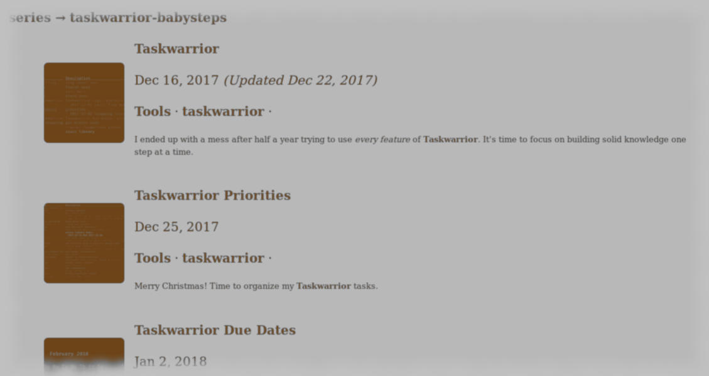

---
aliases:
- /2019/05/12/turning-taskwarrior-posts-into-a-series/
category: post
created: 2024-01-15 15:26:37-08:00
date: 2019-05-12 00:00:00-07:00
description: There's a new taxonomy for posts that are written in a particular order!
slug: turning-taskwarrior-posts-into-a-series
syndication:
  mastodon: https://hackers.town/@randomgeek/102082058493417205
  twitter: https://twitter.com/brianwisti/status/1127486161340063745
tags:
- taskwarrior
- hugo
- site
- tools
title: Turning Taskwarrior Posts Into a Series
updated: 2024-02-01 21:05:03-08:00
---



I want to more clearly show relations between some of my posts. Tags and categories do handle a lot, but they get a bit clunky with stuff like my [Taskwarrior](../../../card/Taskwarrior.md) posts, which specifically build on each other.

[Hugo](../../../card/Hugo.md) supports series as a [taxonomy](https://gohugo.io/content-management/taxonomies/). Let’s find out what that means.

## Update site config

Even though Hugo pays attention to `series` for internal templates, it doesn’t count it towards taxonomies. So let’s add an entry for it in site config.

**`config.toml`**

````toml
[taxonomies]
  # ...
  series = "series"
````

Now every post can be associated with zero or more series, and Hugo will notice.

## Update front matter

Add a `series` array with one entry for all of the Taskwarrior posts so far (but not this one, since it isn’t part of the series).

````yaml
series:
- Taskwarrior Babysteps
````

## Create a series summary page

Oh look, there it is, already sitting at `/series`, thanks to my existing `layouts/_default/terms.html`.


What if I follow *taskwarrior-babysteps*?


*Almost* perfect. But since each post is supposed to build on the others, I’d prefer the listing present its posts in chronological order. I’ll add a template for series listings.

**`layouts/series/series.html`**

````
{{ define "main" }}
  <h1>{{ .Title }}</h1>
  {{- .Content -}}
  {{ partial "term-path" . }}
  <ul class="post-list">
    {{- range .Pages.ByDate -}}
      <li class="post-list-item">
        {{- .Render "li" -}}
      </li>
    {{- end -}}
  </ul>
{{ end }}
````

And while I’m at it, how about an introduction to the series?

**`content/series/taskwarrior-babysteps/_index.md`**

````markdown
---
title: Taskwarrior Babysteps
---

In which I learn just the bits and pieces of [Taskwarrior][] I need to manage my
task list, rather than trying everything, getting overwhelmed, and dropping the
whole thing.

So far so good!

[Taskwarrior]: https://taskwarrior.org/
````

That works for now. I can tighten it up later.


## Link back to the series summary in every series post

Next I want posts to link back to their series main page. I already have a partial for content metadata so I can add it there.

**`layouts/partials/meta.html`**

````
⋮
{{ range .Params.series }}
  <p>Part of the <a class="p-category" href="{{ "series" | absURL }}{{ . | urlize }}/">{{ title . }}</a> series
{{ end }}
````

Then I thought to myself "Oh I know. I’ll add links to the previous and next posts in the series. Shouldn’t be too hard, right?"

Famous last words. After floundering for a bit, I ended up grabbing a [solution](https://discourse.gohugo.io/t/generating-series-navigation/16837) from the Hugo community forums and adjusting it for my tastes.

**`layouts/partials/series-details.html`**

````
{{- if .Params.series -}}
  <section class="meta-series">
  {{- $name := index .Params.series 0 -}}
  {{- $key := $name | urlize }}
  {{- with (index .Site.Taxonomies.series $key) -}}
    {{- $total := .Count -}}
    {{- $startIndex := 0 -}}
    {{- $prevIndex := 0 -}}
    {{- $currIndex := 0 -}}
    {{- $nextIndex := 0 -}}
    {{- $endIndex := ( sub $total 1 ) -}}
    {{- range $index, $page := .Pages.Reverse -}}
      {{- if (eq $page $.Page) -}}
        {{- $currIndex = $index -}}
        {{- $prevIndex = (sub $index 1) -}}
        {{- $nextIndex = (add $index 1) -}}
        <p>Part {{ add $index 1 }} of {{ $total }} in the
          <a href="{{ "series" | absURL }}/{{ $key }}">{{ $name }}</a> series.</p>
      {{ end -}}
    {{- end -}}
    {{- if ge $prevIndex $startIndex -}}
      {{- with (index .Pages.Reverse $prevIndex) -}}
        <p>(Preceded by <a href="{{ .RelPermalink }}">{{ .Title }}</a>)</p>
      {{- end -}}
    {{- end -}}
    {{- if le $nextIndex $endIndex -}}
      {{- with (index .Pages.Reverse $nextIndex) -}}
        <p>(Followed by <a href="{{ .RelPermalink }}">{{ .Title }}</a>)</p>
      {{- end -}}
    {{- end -}}
  {{- end -}}
  </section>
{{- end -}}
````

This is a mess. But hey it works!


That’s pretty much it! Now it’ll be easier for visitors to understand when posts build on each other. At some point I will dig through the rest of my posts to add series-related front matter when applicable. Not today, though.