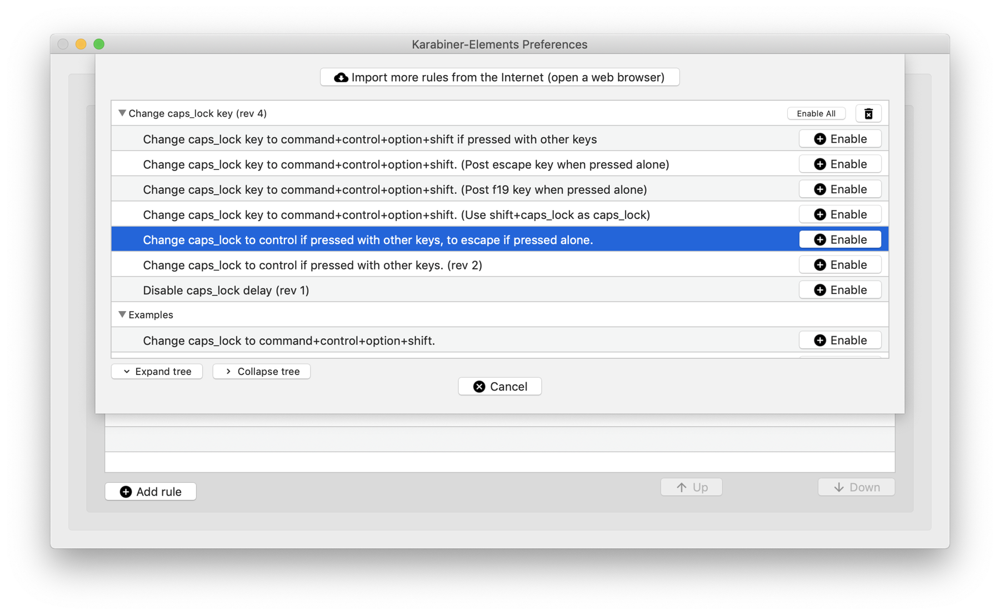

---
aliases:
- /note/2019/0002/
- /note/2019/173/karabiner/
category: note
created: 2024-01-15 15:26:38-08:00
date: 2019-06-22 12:12:00-07:00
slug: karabiner
tags:
- macos
- keyboard
title: Karabiner
updated: 2024-05-01 22:42:57-07:00
---

Grumbled on Twitter about the MBP TouchBar as a Vim user. [genehack](https://twitter.com/genehack) mentioned I could map Caps Lock to Control (my usual) *and* Escape, given the right tools. Ten minutes later I had [Karabiner Elements](https://pqrs.org/osx/karabiner/) installed, a keyboard rule imported, and Vim happiness once again.

Definitely going to mess more with Karabiner.