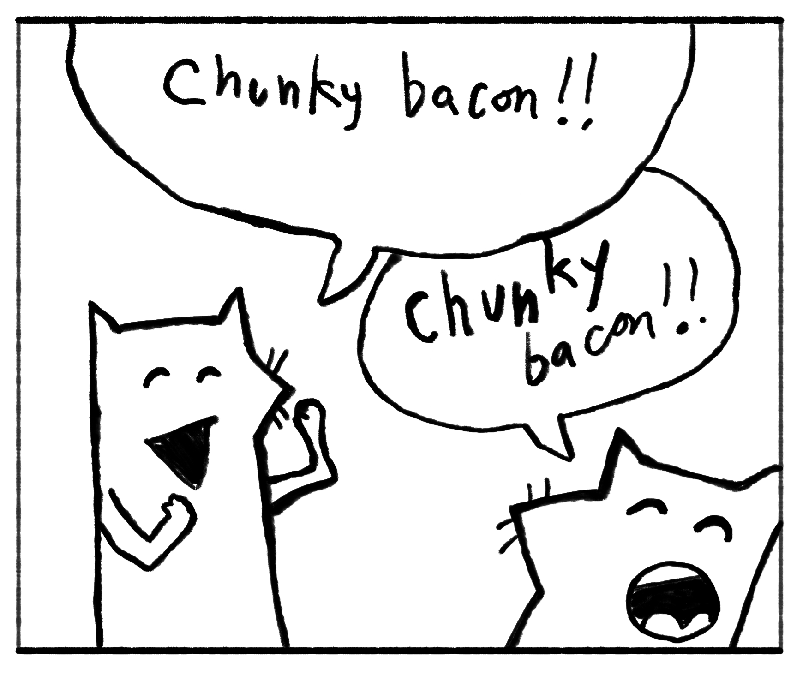

---
aliases:
- /note/2019/185/chunky-bacon/
- /note/2019/07/chunky-bacon/
category: note
date: 2019-07-04 13:41:24-07:00
slug: chunky-bacon
syndication:
  mastodon: https://hackers.town/@randomgeek/102385377642417786
  twitter: https://twitter.com/brianwisti/status/1146899330973855744
tags:
- why-the-lucky-stiff
- internet-history
- notes
- drawing
- chunky-bacon
title: Chunky Bacon
---

Seriously. Chunky. Bacon.

Outlining a post about my Notes experiment. Learned that [\_why](https://en.wikipedia.org/wiki/Why_the_lucky_stiff) coined [card/tumblelog](../../../card/tumblelog.md), which is sort of what the notes are. And then I wanted to make this note. With the foxes. But I couldn't find a nice big version. So I made a nice big
version. It's [Attribution-ShareAlike](https://creativecommons.org/licenses/by-sa/2.5/), just like the original. You can use it.

Go read the [Poignant Guide](https://poignant.guide/) when you have time. I put [CLOSURE](https://github.com/steveklabnik/CLOSURE) on my list.
