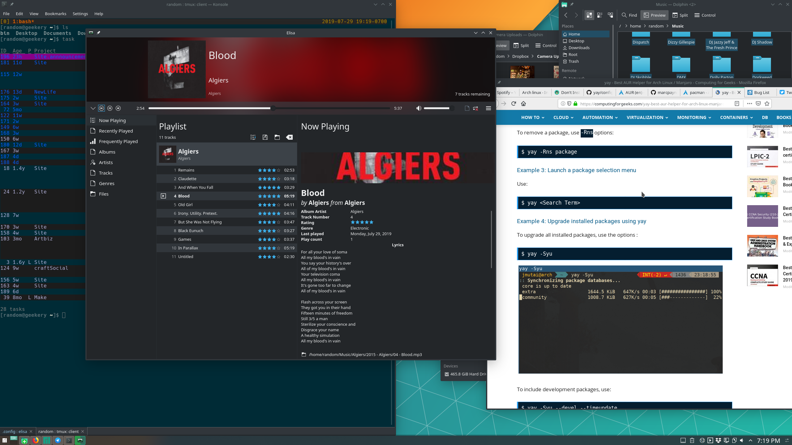

---
aliases:
- /note/2019/210/i-forgot-how-nice-kde-can-be/
category: note
date: 2019-07-29 19:31:39-07:00
slug: i-forgot-how-nice-kde-can-be
syndication:
  mastodon: https://hackers.town/@randomgeek/102528080200310987
  twitter: https://twitter.com/brianwisti/status/1156031774310277120
tags:
- linux
- screenshot
- the-old-ways-die-hard
title: I forgot how nice KDE can be
created: 2024-01-15T15:26:35-08:00
updated: 2024-02-01T21:54:12-08:00
---

Getting work done on one machine, trying [Manjaro](https://manjaro.org/) with *KDE* on the other. I got used to [GNOME Shell](https://wiki.gnome.org/Projects/GnomeShell), which also means I got used to how slow it is. KDE's pretty heavy-weight too, but so much snappier.

