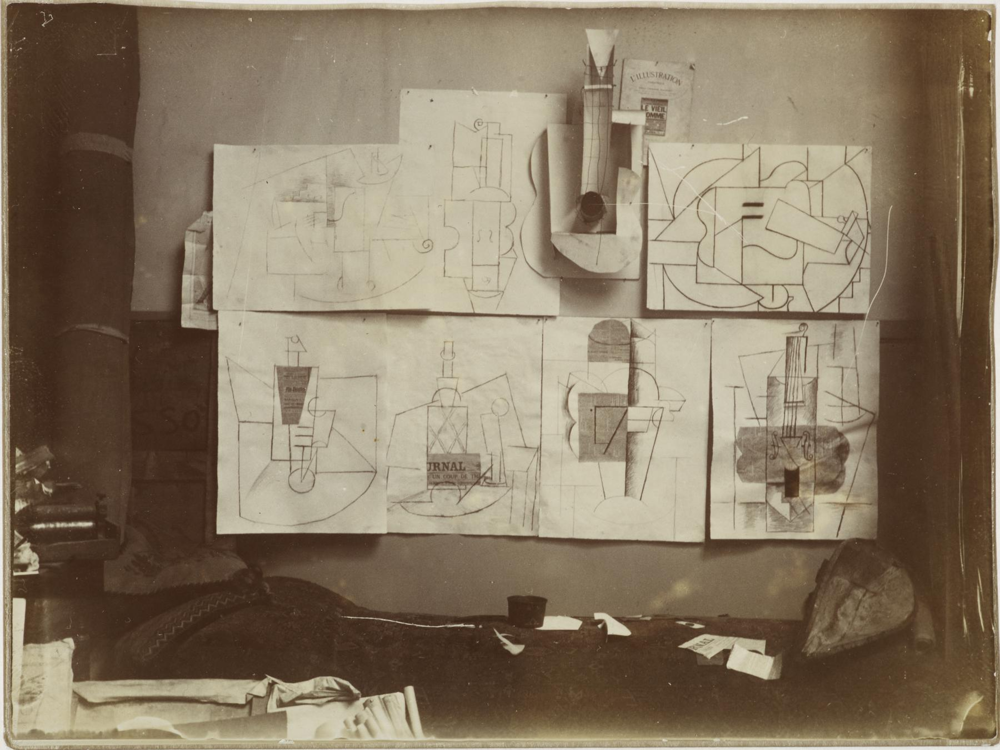

---
aliases:
- /note/2019/184/i-stole-a-great-idea/
category: note
date: 2019-07-03 18:10:51-07:00
slug: i-stole-a-great-idea
syndication:
  mastodon: https://hackers.town/@randomgeek/102380546392209386
  twitter: https://twitter.com/brianwisti/status/1146589994191974401
tags:
- site
title: I Stole A Great Idea
---

Picasso's studio circa 1912, via [Art Observed](http://artobserved.com/2011/03/go-see-new-york-picasso-guitars-1912-1914-at-the-moma-through-june-06-2011/)

 > 
 > Good artists copy; great artists steal.
 > 
 > <cite>([probably not Picasso](https://quoteinvestigator.com/2013/03/06/artists-steal/))</cite>

I like this form better -- from the article linked above.

 > 
 > Immature poets imitate; mature poets steal; bad poets deface what they take,
 > and good poets make it into something better, or at least something different.
 > 
 > <cite>TS Eliot, "The Sacred Woord: Essays on Poetry and Criticism"</cite>

All this is besides the point. When [jmac](https://jmac.org/) writes a blog post, he shares it [on his Twitter account](https://twitter.com/jmacdotorg). Then he puts the tweet link in the blog post, encouraging folks to share or reply via the tweet.

I stole that for here.