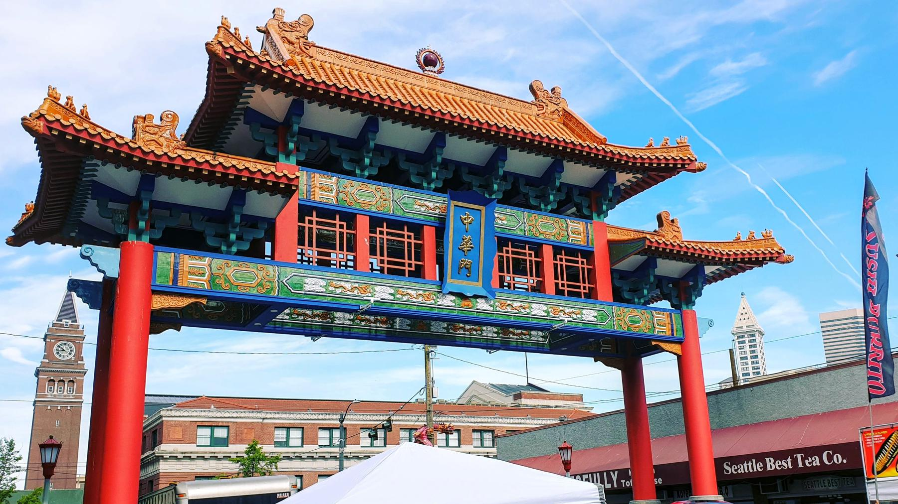

---
aliases:
- /note/2019/182/seattles-chinatown-gate/
category: note
date: 2019-07-01 22:37:11-07:00
slug: seattles-chinatown-gate
syndication:
  mastodon: https://hackers.town/@randomgeek/102370572085841582
tags:
- pic
- seattle
- international-district
- posted-elsewhere
- needs-to-be-here
title: Seattle's Chinatown Gate
---

Colors are a lot brighter in my new neighborhood. [The gate](https://www.historylink.org/File/8485) was dedicated in 2008 to celebrate the neighborhood's [history](http://chinatownconnection.com/seattle-chinatown-history.htm).

Seattle's Chinatown Gate; King Street and Smith Tower behind

That link also helps understand why "International District" and not just "Chinatown":

 > 
 > It is perhaps the only area in the continental United States where Chinese,
 > Japanese, Filipinos, African Americans, Vietnamese, Koreans, and Cambodians,
 > settled together and built one neighborhood.