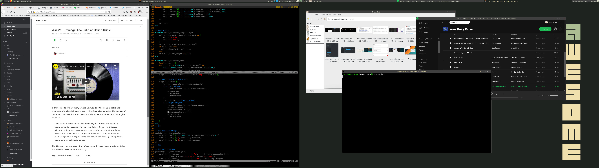

---
aliases:
- /note/2019/229/awesomewm/
- /note/2019/08/awesome-wm/
category: note
created: 2024-01-15 15:26:37-08:00
date: 2019-08-17 16:29:10-07:00
slug: awesome-wm
syndication:
  mastodon: https://hackers.town/@randomgeek/102635062443230436
  twitter: https://twitter.com/brianwisti/status/1162878591044112391
tags:
- linux
- awesomewm
- screenshot
- fiddly-configurations-are-fun
title: Awesome(wm)
updated: 2024-02-01 22:07:02-08:00
---

full screenshots are a bit unwieldy with dual monitors.

There's been way too much "it just works (more or less)" in my desktop life lately, so I started using the [awesomewm](https://awesomewm.org) tiling window manager.

Disappointingly, it works just fine.

Still, good chance to learn enough [Lua](../../../card/Lua.md) to customize my setup. Looks like I'll be revisiting [kitty-terminal](../05/kitty-terminal.md) and a few other tools that have been on the task list for a while.