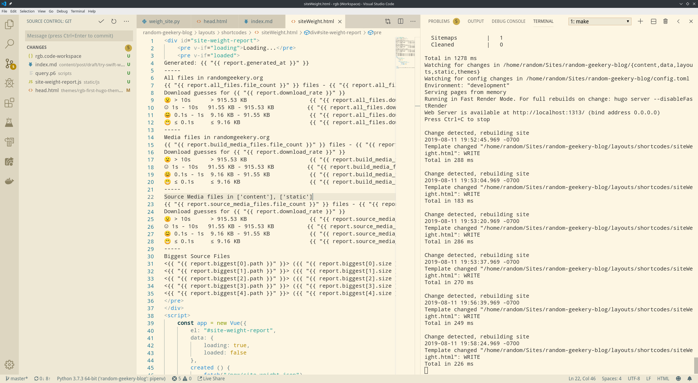

---
aliases:
- /note/2019/223/proudly-doing-it-wrong/
- /note/2019/08/proudly-doing-it-wrong/
category: note
date: 2019-08-11 20:04:00-07:00
slug: proudly-doing-it-wrong
syndication:
  mastodon: https://hackers.town/@randomgeek/102601881134003629
  twitter: https://twitter.com/brianwisti/status/1160754746397011968
tags:
- screenshot
- javascript
- no-i-know
- i-ll-fix-it
title: Proudly doing it wrong
created: 2024-01-15T15:26:40-08:00
updated: 2024-02-02T09:55:58-08:00
---

Yeah that's Visual Studio Code. I'm trying new things.

1. write a [site weight](../06/weighing-files-with-python.md) script that prints a report to the console
1. make the script write the report to a file, and include the file in [now](../../../page/now.md). Now site building looks like:
   1. build the site
   1. weigh the site
   1. build the site and include the new report
   1. upload!
1. (today) make the script write the info as JSON instead
1. throw in some [vue.js](https://vuejs.org/) to fetch the JSON and reproduce the original report format almost exactly.
1. profit?

But hey at least I don't need to rebuild the site after weighing it. And when free time next allows I'll learn a little more Vue.js and make the report prettier.
