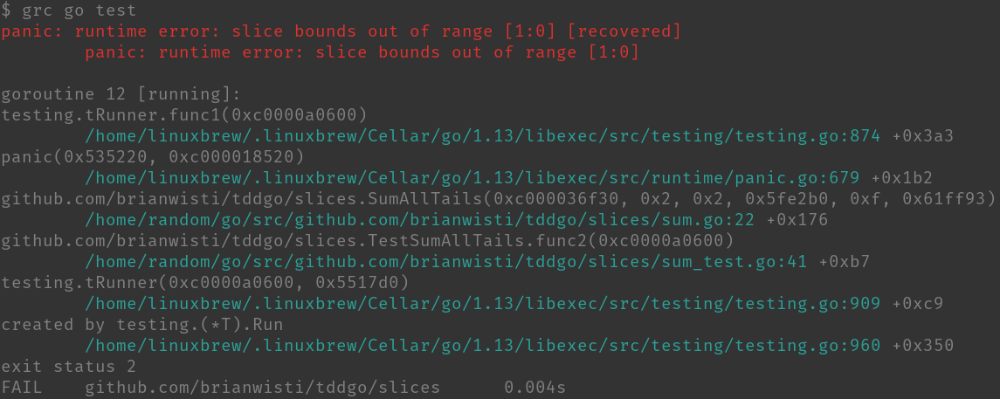

---
aliases:
- /2019/09/08/colorized-my-go-output-with-grc/
category: post
date: 2019-09-08 00:00:00-07:00
description: In which I spent Sunday having fun learning stuff
slug: colorized-my-go-output-with-grc
syndication:
  mastodon: https://hackers.town/@randomgeek/102759304764890808
  twitter: https://twitter.com/brianwisti/status/1170830219390963713
tags:
- go
- shell
- tools
title: Colorized my go output with grc
created: 2024-01-15T15:26:38-08:00
updated: 2024-02-01T19:59:53-08:00
---

Enjoying myself with [Go](../../../card/Go.md) as I go through [Learn Go with Tests](https://github.com/quii/learn-go-with-tests) by [Chris James](https://quii.dev/).


some go compiler output all pretty

I didn’t enjoy myself on the [official tour](https://tour.golang.org/welcome/1), or with whatever LinkedIn course it was that I took. The structure and flow of the learn-by-testing piece gives me a familiar context and the pace seems just about right. It’s giving me ideas where I might enjoy Go for my own projects.

So yeah I like it.

Still having some *tiny* issues with the output of `go test`.


Part of it’s that my brain hasn’t gotten used to how Go displays its errors. Some of it’s that my brain always has — and always will — panic at random symbols without context.

I figured I wasn’t the first with this problem, so I went looking. Found a [Stack Overflow answer](https://stackoverflow.com/a/40160711) pointing me to [grc](https://github.com/garabik/grc). Installed via [Homebrew](https://brew.sh/), then followed directions from Stack Overflow to configure grc, with a slight tweak to `~/.grc/conf.gotest`.

grc needs an entry in `~/.grc/grc.conf` for Go test runs.

````text
 # Go
 \bgo.* test\b
 conf.gotest
````

I did make a slight tweak to the suggested `~/.grc/conf.gotest`, so that "panic" lines get highlighted as failures.

````text
regexp==== RUN .*
colour=blue
-
regexp=--- PASS: .*
colour=green
-
regexp=^PASS$
colour=green
-
regexp=^(ok|\?) .*
colour=magenta
-
regexp=^\s*panic: .*
colour=red
-
regexp=--- FAIL: .*
colour=red
-
regexp=[^\s]+\.go(:\d+)?
colour=cyan
````

Now when I run tests through `grc go test`, output is colorized and I can track it more easily!


Of course I’ll probably get used to how Go presents errors and then forget all about `grc`, but it’s great for today. Might be more generally useful too, if I want colorized output that my tools don’t already provide!
