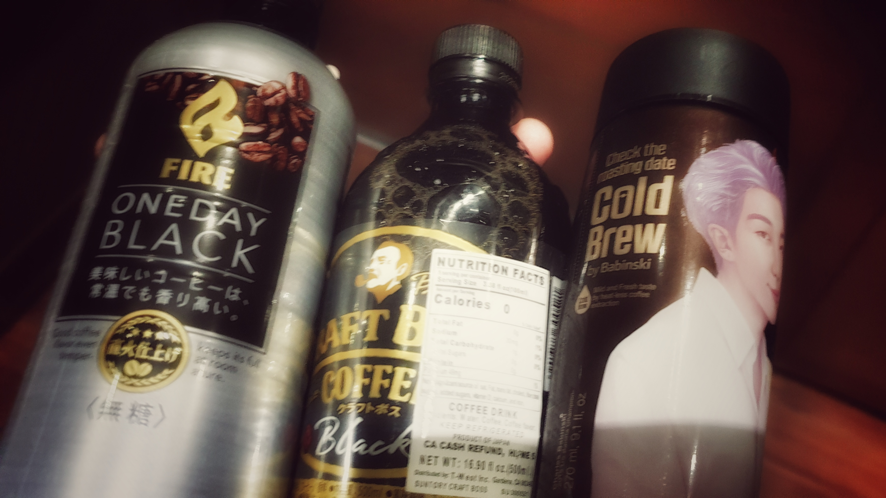

---
aliases:
- /note/2019/271/do-not-shop-on-first-coffee/
- /note/2019/09/do-not-shop-on-first-coffee/
category: note
date: 2019-09-28 10:02:01-07:00
slug: do-not-shop-on-first-coffee
syndication:
  mastodon: https://hackers.town/@randomgeek/102871305091759777
  twitter: https://twitter.com/brianwisti/status/1177997950590603265
tags:
- coffee
- watch
- music
- now
title: Do not shop on first coffee
---

three brands of bottled coffee

Got sidetracked while picking up breakfast stuff from [Uwajimaya](https://www.uwajimaya.com/). Should probably have finished my first cup of coffee before I left. Could have been worse. There was an entire boy band worth of that Babinski Cold Brew. I only took one.

Meanwhile, someone put a flyer on the apartment bulletin board for the [Earshot Jazz Festival](https://www.earshot.org/2019-earshot-jazz-festival/). Checked to see if any of the names were familiar. Most were new to me, but I recognized  — and enjoy — [Knife Knights](https://knifeknights.bandcamp.com/).

A jazz context makes more sense for Knife Knights than rap/hip-hop, which is where I usually see them filed. Heck, genres are meaningless anyways. My favorite music stores just arrange albums alphabetically.

Anyways, time to drink some coffee!

