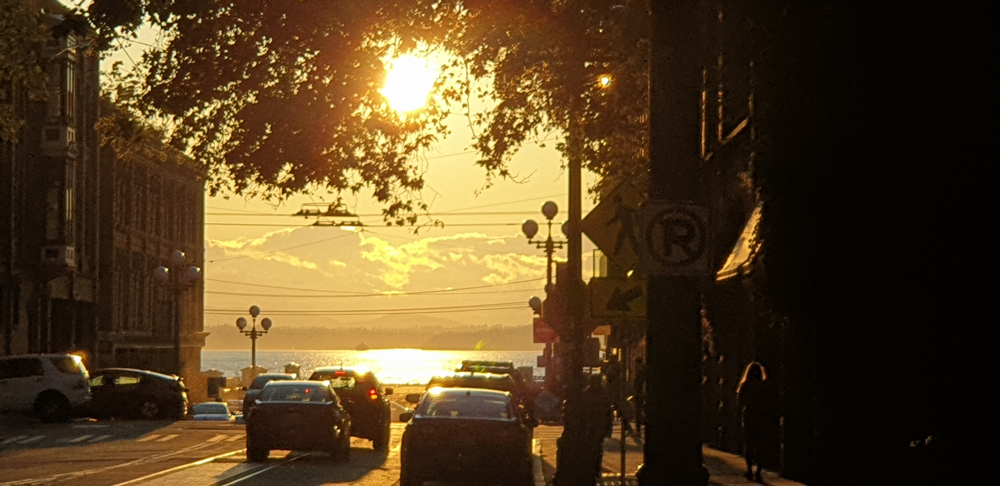

---
aliases:
- /note/2019/263/pioneer-square-has-a-view-now/
- /note/2019/09/pioneer-square-has-a-view-now/
category: note
created: 2024-01-15 15:26:36-08:00
date: 2019-09-20 07:56:53-07:00
slug: pioneer-square-has-a-view-now
syndication:
  mastodon: https://hackers.town/@randomgeek/102825645202833283
  twitter: https://twitter.com/brianwisti/status/1175075990055391232
tags:
- seattle
- now
title: Pioneer Square has a view now
updated: 2024-05-01 22:42:18-07:00
---

We went out for dinner the other evening, and once the sun was no longer blasting directly in our eyes — yay for [precession of the equinoxes](https://www.britannica.com/science/precession-of-the-equinoxes) — we were treated to a hell of a sight.

Sunset view of Puget Sound from Main Street in Seattle

See, the [Alaskan Way Viaduct](https://www.seattlepi.com/local/transportation/article/Photos-65-years-of-the-Alaskan-Way-Viaduct-13284852.php) has blocked any real view of the Puget Sound  from ground level since the 1950s. But it's [going away](https://www.wsdot.wa.gov/Projects/Viaduct/). Near Pioneer Square, it's gone. I can look right at the water.

Until they start building up that [juicy real estate](https://www.realchangenews.org/2019/03/13/goodbye-viaduct-hello-prime-real-estate), of course. But I'll enjoy it while I can.