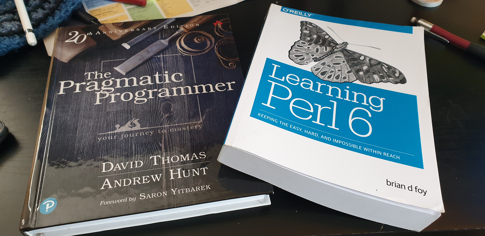

---
redirects:
- /note/2019/285/a-good-day-for-books/
- /note/2019/10/a-good-day-for-books/
category: note
date: 2019-10-12 14:37:45-07:00
slug: a-good-day-for-books
syndication:
  mastodon: https://hackers.town/@randomgeek/102951835247015657
  twitter: https://twitter.com/brianwisti/status/1183152199888723969
tags:
- toread
- pragprog
- raku-lang
- perl6
- i-need-to-read-faster
title: A good day for books
created: 2024-01-15T15:26:37-08:00
updated: 2024-02-01T19:51:38-08:00
---

Decided I wanted a copy of "[Learning Perl 6](https://www.learningperl6.com/)" before it becomes "Learning [Raku](http://blogs.perl.org/users/ovid/2019/10/larry-has-approved-renaming-perl-6-to-raku.html)". I give my bookshelf room for nostalgia, though the name shift to [Raku](../../../card/Raku.md) is understandable.

And of *course* I needed a physical copy of the 20th Anniversary [Pragmatic Programmer](https://pragprog.com/book/tpp20/the-pragmatic-programmer-20th-anniversary-edition).
