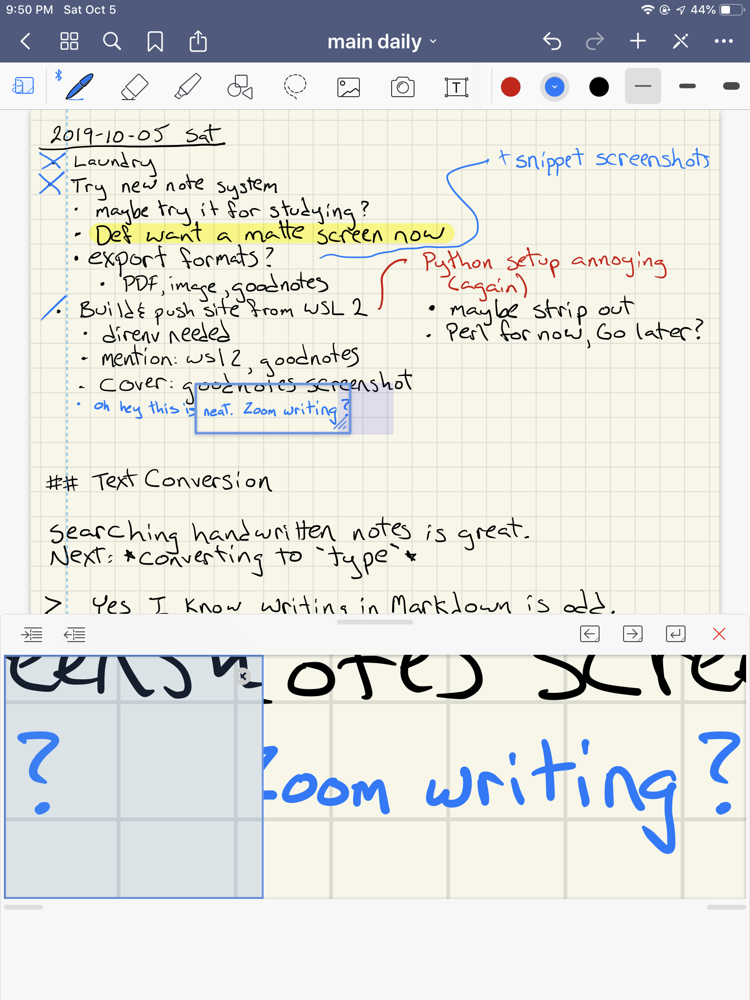

---
aliases:
- /note/2019/10/we-went-to-the-mall-later-i-bought-an-app/
category: note
date: 2019-10-05 23:30:39-07:00
slug: we-went-to-the-mall-later-i-bought-an-app
syndication:
  mastodon: https://hackers.town/@randomgeek/102914154102080827
  twitter: https://twitter.com/brianwisti/status/1180740438338224128
tags:
- ios
- notes
- windows
- no-the-other-kind
- the-ones-you-write
- notebooks
- yeah-those
title: We went to the mall. Later, I bought an app.
---

GoodNotes screenshot

We went to the Apple store. I played with a new iPad Pro. Tried hard not to like it, but it was a really pleasant experience.

The demo iPad had a great note-taking app that could help my search for an app that let me handwrite notes and then search through their content later.

Been messing with Windows and *inbox/WSL* more lately. So we went to the Microsoft store too. I tried hard to like it, but everything felt a little clumsy and disappointing after the smoothness of the Apple devices.

When I got home I had to find and install [GoodNotes](https://www.goodnotes.com/), the notebook app I played with at the Apple Store, on my own iPad. Yeah I like it. This will come in real handy.

Oh and I want a matte screen *protector*. Supposedly gives you more of a paper feel when working on the iPad.
