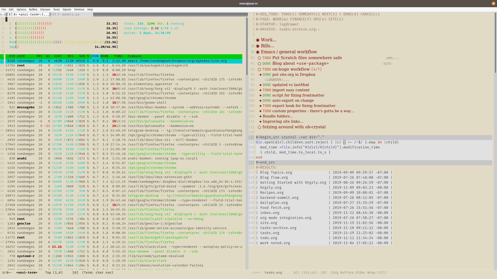

---
aliases:
- /note/2019/323/having-fun-with-emacs/
- /note/2019/11/having-fun-with-emacs/
category: note
created: 2024-01-15 15:26:36-08:00
date: 2019-11-19 21:26:30-08:00
slug: having-fun-with-emacs
syndication:
  mastodon: https://hackers.town/@randomgeek/103168606088481294
  twitter: https://twitter.com/brianwisti/status/1197025157770031104
tags:
- emacs
- ansi-term
- orgmode
- htop
- overkill
title: Having fun with Emacs
updated: 2024-05-01 22:44:42-07:00
---

I kind of understand what folks say about [Emacs](../../../card/Emacs.md) being their operating system.

BTW the theme is the [poet](https://github.com/kunalb/poet) package, more or less.