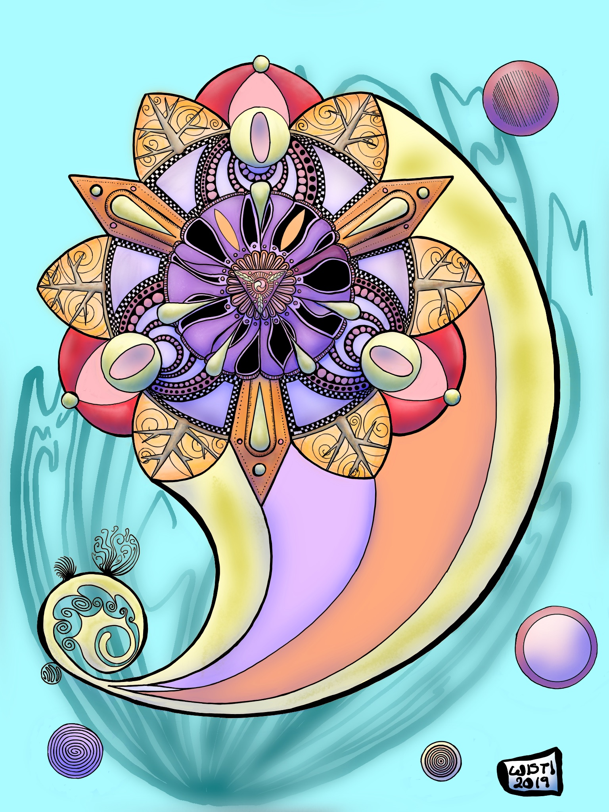

---
aliases:
- /note/2019/311/some-manual-symmetry-with-linea-sketch/
- /note/2019/11/some-manual-symmetry-with-linea-sketch/
category: note
created: 2024-01-15 15:26:40-08:00
date: 2019-11-07 07:27:55-08:00
slug: some-manual-symmetry-with-linea-sketch
syndication:
  mastodon: https://hackers.town/@randomgeek/103097411448248749
  twitter: https://twitter.com/brianwisti/status/1192469049491542016
tags:
- drawing
- symmetry
- linea-sketch
title: Some manual symmetry with Linea Sketch
updated: 2024-05-01 22:44:18-07:00
---

[WelshPixie](http://delsdoodles.com/) draws amazing mandala images. Inspired me to do something in [Linea Sketch](https://linea-app.com/), a drawing app defined by its constraints. No symmetry tools. A focused approach to color palettes. Brushes limited to a couple pencils, a couple pens. Five layers, no more and no less. Stuff like that.

It does have circle and straight edge drawing tools, which I clearly took full advantage of.

The only feature I miss in Linea is custom canvas sizes. All drawings are exactly however many pixels your iPad has.